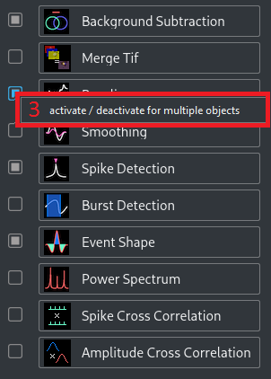

# NOSA 

Content: 
1. [General Information](#general-information)
2. [Contact Information](#contact-information)
3. [License Information](#license-information)
3. [Software NOSA uses and their Licenses](#software-nosa-uses-and-their-licenses)
4. [NOSA User Manual](#nosa-user-manual)
5. [NOSA Developer Manual](#nosa-developer-manual)

## General Information

NOSA (Neuro-Optical Signal Analysis) is a software tool that specializes on optical electrophysiology using voltage sensitive fluorescence proteins. However, NOSA can also evaluate data recorded using voltage-sensitive dyes and patch clamp data.

NOSA should be used with care and users should read the [user manual](#nosa-user-manual) first. NOSA will not check every input for validity and may crash when bad settings are made. 

## Contact Information

NOSA is developed and provided by the [Institute of Neurophysiology of Charité Berlin](https://neurophysiologie.charite.de/en/). Contact Person is [Davide Raccuglia](https://neurophysiologie.charite.de/en/metas/person_detail/person/address_detail/raccuglia/). 

## License Information

NOSA is distributed with the MIT license. The license file is named `LICENSE.txt` and should be part of this software package. Information about the MIT license can be found [here](https://choosealicense.com/licenses/mit/).

## Software NOSA uses and their Licenses

NOSA is written in [Python](https://www.python.org/) 3.7.1 (see https://docs.python.org/3/license.html for license information), and next to its default packages and built in functions, NOSA uses a variety of additional packages. In the following table, an overview is given. Additionally, this documentation includes a directory named `package_licenses` where, a copy of the license for every used package is provided.

Name | Version | License type | Copyright Notice | Website
--- | --- | --- | --- | ---
NumPy | 1.16.2 | [BSD](https://www.numpy.org/license.html#license) | Copyright © 2005-2018, NumPy Developers.<br>All rights reserved. | https://www.numpy.org
SciPy | 1.2.1 | [BSD](https://scipy.org/scipylib/license.html) | Copyright © 2001, 2002 Enthought, Inc.<br>All rights reserved.<br><br>Copyright © 2003-2013 SciPy Developers.<br>All rights reserved. | https://www.scipy.org
PyQt5 | 5.11.3 | [GPL v3](https://www.riverbankcomputing.com/static/Docs/PyQt5/introduction.html#license) | Copyright © 2018 Riverbank Computing Limited | https://www.riverbankcomputing.com/software/pyqt/
PyQtGraph | 0.10.0 | [MIT](https://github.com/pyqtgraph/pyqtgraph/blob/develop/LICENSE.txt) | Copyright (c) 2012  University of North Carolina at Chapel Hill<br>Luke Campagnola ('luke.campagnola@%s.com' % 'gmail') | http://www.pyqtgraph.org
Matplotlib | 3.0.3 | [PSF-based](https://matplotlib.org/users/license.html) | © Copyright 2002 - 2012 John Hunter, Darren Dale, Eric Firing, Michael Droettboom and the Matplotlib development team; 2012 - 2018 The Matplotlib development team | http://matplotlib.org
pyStackReg | 0.2.1 | [custom](https://bitbucket.org/glichtner/pystackreg/src/master/LICENSE.txt) | C++ Port of the TurboReg ImageJ Plugin<br><br>Original code by Philippe Thevenaz (see the file `package_licenses/custom_license_for_pyStackReg.txt`)<br><br>Porting by Gregor Lichtner | https://bitbucket.org/glichtner/pystackreg
DIPY | 0.15.0 | [revised BSD-2-Clause](http://nipy.org/nipy/license.html) | Copyright (c) 2008-2019, dipy developers<br>All rights reserved. | http://dipy.org
QDarkStyle | 2.5.4 | [MIT](https://github.com/ColinDuquesnoy/QDarkStyleSheet/blob/master/LICENSE.md) | Copyright (c) 2013-2018 Colin Duquesnoy | https://github.com/ColinDuquesnoy/QDarkStyleSheet
neo | 0.7.1 | [BSD-3-Clause](https://github.com/NeuralEnsemble/python-neo/blob/master/LICENSE.txt) | Copyright (c) 2010-2018, Neo authors and contributors | http://neuralensemble.org/neo
quantities | 0.12.3 | [BSD](https://python-quantities.readthedocs.io/en/latest/user/license.html) | Copyright (c) 2012, Darren Dale <dsdale24@gmail.com> All rights reserved. | http://python-quantities.readthedocs.io/
XlsxWriter | 1.1.5 | [BSD](https://xlsxwriter.readthedocs.io/license.html) | Copyright (c) 2013, John McNamara <jmcnamara@cpan.org> All rights reserved. | https://github.com/jmcnamara/XlsxWriter
tifffile | 2019.3.8 | [BSD](https://www.lfd.uci.edu/~gohlke/) | Copyright (c) 1994-2019, Christoph Gohlke<br>All rights reserved. | https://www.lfd.uci.edu/~gohlke/
PyInstaller | 3.4 | [GPL-based](http://www.pyinstaller.org/license.html) | Copyright (c) 2010-2019, PyInstaller Development Team<br>Copyright (c) 2005-2009, Giovanni Bajo<br>Based on previous work under copyright (c) 2002 McMillan Enterprises, Inc. | http://www.pyinstaller.org/
Markdown | 1.0.1 | [BSD-style](https://daringfireball.net/projects/markdown/license) | Copyright © 2004, John Gruber<br>http://daringfireball.net/<br>All rights reserved. | https://daringfireball.net/projects/markdown/
markdown-styles | 3.1.10 | [BSD-3-Clause](https://www.npmjs.com/package/markdown-styles) | none provided -- created by GitHub user [mixu (Mikito Takada)](https://github.com/mixu) | https://github.com/mixu/markdown-styles

Since NOSA uses the PyQt5 package as stated above, it should be noted that the [Qt](https://www.qt.io/) package is used with the [LGPL v3](https://doc.qt.io/qt-5/lgpl.html) license.

The software PyInstaller is used for building the application. See also the README file provided with NOSA.

The software Markdown and markdown-styles are used for this documentation. It is written in the Markdown language and to convert the `.md` file to a `.html` file, the markdown-styles software is used. Please note that there is no explicit copyright notice provided for the markdown-styles software, and there is no license text. This is why in the `packages_licenses` directory, there is a default BSD-3-Clause license named `default-BSD-3-Clause_license_for_markdown-styles.txt`. 

UML Diagrams that are used in the [NOSA Developer Manual](#nosa-developer-manual) are created with Visual Paradigm Community Edition, which is available at https://www.visual-paradigm.com/. 

Since NOSA uses the pyStackReg package as stated above, we want to note the publication the original source code originates from: [P. Thevenaz, U. E. Ruttimann, and M. Unser (1998). A pyramid approach to subpixel registration based on intensity. _IEEE Transactions on Image Processing, 7_(1), 27-41](https://doi.org/10.1109/83.650848)

Since NOSA uses the DIPY package as stated above, we want to note the publication it originates from: [E. Garyfallidis, M. Brett, B. Amirbekian, A. Rokem, S. van der Walt, M. Descoteaux, I. Nimmo-Smith, and Dipy Contributors (2014). DIPY, a library for the analysis of diffusion MRI data. _Frontiers in Neuroinformatics, vol.8_ (8)](https://doi.org/10.3389/fninf.2014.00008). 

## NOSA User Manual

In the following sections, these aspects of NOSA will be explained:

1. [GUI (Graphical User Interface) Components](#gui-components)
2. [Features and Methods](#features-and-methods)
3. [Performance Aspects](#performance-aspects)
4. [Typical Workflow Examples](#typical-workflow-examples)

### GUI Components

When starting NOSA, the user will see a screen similar to this:


Once data is imported, features are activated and plots are customized, it may look similar to this:


In the following image, specific areas are highlighted describing the components of NOSA. All components will be described in the following sections.

1. [Source Manager](#source-manager)
2. [Object Manager](#object-manager)
3. [Cell Selection and Raw Plot](#cell-selection-and-raw-plot)
4. [Plots](#plots)
5. [Pipeline Manager](#pipeline-manager)
6. [Feature View](#feature-view)


__Please note__: It may happen that the user interface is inconsistent. For example, this sometimes happened when one selects an object: the checkboxes that indicate the active state of the features were not refreshed. Or plots were not repainted, still showing data from the object that was selected before. If something like this happens, one should move the mouse over the inconsistent area, such that the area will be repainted. 

#### Source Manager

The Source Manager gives an overview of imported files (called sources).

In the following images, specific areas are highlighted describing the components of the Source Manager. All components will be described in the following sections.

1. [List of sources](#list-of-sources)
2. [Button: Add](#add)
3. [Button: Movement Correction](#movement-correction)
4. [Button: Crop](#crop)
5. [Button: Offset](#offset)
6. [Button: Delete](#delete)
7. [Option with right click: Adjust Frequency](#adjust-frequency)


##### List of sources

The Source Manager lists all sources that are in the program. The filename, the frame selection, frequency, and offset are displayed. 
If there is at least one source in the program, there will always be exactly one source that is selected.

##### Add

With this button, the user can import sources into the program. A file dialog will pop up and the user should select a file from their computer. Right now, the following data types are supported:

Optical data:
* Tagged Image File Format (TIFF) (`.tif`, `.tiff`)

Patch clamp data:
* Axon Binary File (ABF) (`.abf`)

When importing a TIFF, the user additionally must set the recording frequency such that the number of frames can be transformed into a time scale.

When importing an ABF, the user can ask NOSA to connect multiple sweeps that belong to the same channel, are continuous in time, and have the same unit (see the following images). In both cases, the user must select what they want to import by checking the checkboxes in the first column of the table. NOSA does not distinguish between units. The user can import data of any unit, and NOSA will name the y-axes of [plots](#plots) accordingly and name the unit when [exporting](#export).


##### Movement Correction

With this button, the user can do a x-y-movement correction for the currently selected optical data source. For more information, see the [feature Movement Correction](#movement-correction-1).

##### Crop

With this button, the user can crop frames of the currently selected source to select a time window of interest. For example, this is useful when a measurement was started long before the experiment of interest begins. In such an example, the user can tell NOSA to use a later frame as the start frame. 

The frame specified by cropping are based on the recorded frequency and not affected by the [Feature Adjust Frequency](#adjust-frequency-1).

Please note that when the [feature Movement Correction](#movement-correction-1) is active for the currently selected source and the user crops, the Movement Correction will be recomputed. This may take a while.

##### Offset

With this button, the user can set an offset for the currently selected source. This is essential for a correct calculation within the features [Amplitude Cross Correlation](#amplitude-cross-correlation) and [Spike Cross Correlation](#spike-cross-correlation) and the correct representation when [comparing data in plots](#compare-objects). For the following images, four different objects belonging to four different sources were added in NOSA. The depicted data is the same, but it is lagged. In the first image (1), there is no offset; in the second image (2), the offset is set correctly.


##### Delete

With this button, the user can delete the currently selected source. This also removes all the objects that belong to the source. 

This does NOT remove the actual file from the disk content.

##### Adjust Frequency

With a right click, the user can adjust the frequency of the currently selected source. This does not affect [cropping](#crop). For more information, see the [feature Adjust Frequency](#adjust-frequency-1).

#### Object Manager

The Object Manager gives an overview of all objects that belong to sources. An object is named ROI (Region of Interest) when it belongs to an optical data source.

In the following images, specific areas are highlighted describing the components of the Object Manager. All components will be described in the following sections.

1. [List of objects](#list-of-objects)
2. [Button: Add](#add-1)
3. [Button: Add Copies](#add-copies)
3. [Button: Name](#name)
4. [Button: Delete](#delete-1)
5. [Button: Export](#export)
6. [Option with right click: invert all](#invert-all)
7. [Option with right click: remove invert all](#remove-invert-all)
8. [Option with right click: delete multiple](#delete-multiple)


##### List of objects

The Object Manager displays a list of all objects that are in the program. Whenever a source is imported into the program, an object that belongs to this source is created automatically. If there is at least one object in the program, there will always be exactly one object that is selected.

In the first column, every object has a checkbox. This checkbox determines whether this object is displayed in the [Cell Selection](#cell-selection) (if it belongs to an optical source), in the [comparing plots](#compare-objects) and in the Features [Amplitude Cross Correlation](#amplitude-cross-correlation) and [Spike Cross Correlation](#spike-cross-correlation).

In the second column, the name of every object is displayed. The default name is "ROI x - y" for optical data with x and y as generic numbers. For example, the default name "ROI 3 - 2" is the second added ROI for the third-imported source. Objects that belong to patch clamp data sources are default named "Z x - 1", where x is again a generic number and Z is the file type. For example, "ABF 2 - 1" is the object that belongs to the second-imported source, which is of the type ABF. The name of every object can be changed by either double clicking on that object or using the [name button](#button-name). 

The third column references the source the object belongs to. 

In the fourth column, every object has a checkbox. This checkbox determines whether the [processed data](#data-notations] of this object should be inverted (multiplied by -1). This can also be done for multiple objects at once by using the [option with right click: invert all](#invert-all) and the [option with right click: remove invert all](#remove-invert-all). 

##### Add

With this button, the user can add a new object. Initially, the newly added object will have the same settings as the selected object, except for the position, size, and angle. Here, the default parameters will be used. After the new object is added, it is automatically the selected object. 

##### Add Copies

With this button, the user can add multiple new objects. A dialog will show, where the user can select a checkbox for every existing object. For every checked checkbox, a new object will be created whose initial settings will be copied from the referenced existing object. All objects created in this way will belong to the currently selected source.

##### Name

With this button, the user can rename the currently selected object.

##### Delete

With this button, the user can delete the currently selected object. If the currently selected object is the only object belonging to the source it belongs to, the source will be deleted too. With the [option with right click: delete multiple](#delete-multiple), multiple objects can be deleted at once. 

##### Export

With this button, the user can export data into a Microsoft Excel Open XML Format Spreadsheet (`.xlsx`) file. When the button is clicked, a dialog similar to this will show:


The marked areas are components that are described as follows:

1. List with checkboxes for every object. The user can select which objects to export. With a right click in this area, the user has two more options: selecting and deselecting all objects at once.
2. List with checkboxes for every piece of data. The user can select which data to export. This list consists of the [raw data](#data-notations), the [processed data](#data-notations) and the [Processing and Analysis Features](#features-and-methods). With a right click in this area, the user has two more options: selecting and deselecting all data options at once.
3. Settings to be made. For now, this includes the setting `CC only inside sources`, which means that the Cross Correlation data will be exported only for combinations of objects that belong to the same source. 
4. The file to be created and a button to change it. The user can click on the button and a file dialog will show, that allows the user to set a location and filename. Please note: if the given filename has a specified file type that is not `.xlsx`, e.g. `.txt`, the filename is not valid and will not be used. However, the user may select a filename that ends with `.txt.xlsx`, for example.
5. The buttons Export and Cancel. The Export button will create the specified file and fill it with the specified data. The Cancel button will cancel the process.

Please note that when there are objects with many data points, exporting some of the data may take a long time. Only data with up to 1,048,475 data points can be exported correctly.

##### Invert all

With a right click, the user can invert all objects at once.

##### Remove invert all

With a right click, the user can remove the inversion for all objects at once.

##### Delete multiple

With a right click, the user can delete multiple objects at once. 

#### Cell Selection and Raw Plot

For optical data, the cell selection gives the user the ability to select a ROI, and displays all ROIs belonging to the currently selected source. For patch clamp data, the cell selection is not used. The raw plot displays the [raw data](#data-notations) or the output of the [Background Subtraction](#background-subtraction), if it is active.

In the following images, specific areas are highlighted describing the components of the cell selection and raw plot. All components will be described in the following sections.

1. [Cell Selection](#cell-selection)
2. [Raw Plot](#raw-plot)
3. [Options with right click: PyQTGraph context menu options](#pyqtgraph-mouse-interaction) 
4. [Option with right click: live preview mode](#live-preview-mode)
5. [Option with right click: ellipse mode](#ellipse-mode)


##### Cell Selection

In the example image above, multiple things in the Cell Selection are visible:
* the four colored objects: ROIs, which can be further divided into:
	* the currently selected ROI (the purple circle in the bottom area of the Cell Selection)
	* the [Background Subtraction ROI](#background-subtraction) of the currently selected ROI (the blue dashed line style circle in the top right of the Cell Selection)
	* all other ROIs that belong to the currently selected source (the green rectangle and the red ellipse)
* the image displayed: the currently selected frame of the video source
* contrast modulation on the right side: provided by [PyQtGraph's ImageView](http://www.pyqtgraph.org/documentation/widgets/imageview.html), described as "histogram of image data with movable region defining the dark/light levels"

ROIs can be recognized by the following style rules:
* [Background Subtraction ROIs](#background-subtraction) are always blue-colored and dash-lined, all other ROIs are never blue-colored and solid-lined
* the line color of every ROI is the same as the color it has in the [list of objects in the Object Manager](#list-of-objects)
* only the currently selected ROI and the [Background Subtraction ROI](#background-subtraction) have handles (the small circle and rectangle in the right area of the ROI)

The currently selected ROI and the [Background Subtraction ROI](#background-subtraction) can be moved and changed in size and angle (the ROI's angle can not be changed if in [rectangle mode](#ellipse-mode)). Changing the size and angle can result in an ROI similar to the red one in the example image above. The purple one is of default size and angle. The green one is in [rectangle mode](#ellipse-mode). 

A [Background Subtraction ROI](#background-subtraction) is only displayed if the [Background Subtraction](#background-subtraction) is active for the currently selected object.

For mouse interaction like zooming or dragging, please see [PyQtGraph mouse interaction](#pyqtgraph-mouse-interaction).

##### Raw Plot

In white, the raw plot displays the [raw data](#data-notations) or the output of the [Background Subtraction](#background-subtraction), if it is active. The yellow vertical line at frame 0 in the example image above is used as the [Cell Selection](#cell-selection) video slider. The user can drag this line in the interval of valid frames.

Please note: the raw plot also displays the [markers used in the Baseline Polynomial Fitting](#polynomial-fitting). These look very similar to the video slider. 

The x-axis of the raw plot displays the number of frames. This axis will not be affected by the feature [Adjust Frequency](#adjust-frequency-1).

For mouse interaction like zooming or dragging, please see [PyQtGraph mouse interaction](#pyqtgraph-mouse-interaction).

##### Live preview mode

With a right click, the user can activate and deactivate the live preview mode. Whenever a ROI is changed in position, angle, or size, the [raw plot](#raw-plot) and the [processed data](#data-notations) will be refreshed once the mouse button is released. The live preview mode determines whether this update should also happen while the mouse button is clicked, e.g. while the user is moving the ROI.

##### Ellipse mode

With a right click, the user can switch between the ellipse mode (ellipse mode active) and rectangle mode (ellipse mode not active). This mode is specific for every ROI and determines whether the ROI is an ellipse (ellipse mode) or a rectangle (rectangle mode). 

#### Plots

In the following image, specific plot areas are highlighted displaying the following data:

1. Processed data (changed by [Background Subtraction](#background-subtraction), [Baseline](#baseline), [Smoothing](#smoothing), [inversion](#list-of-objects) and [Adjust Frequency](#adjust-frequency-1))
2. [Spike Detection](#spike-detection) (left) and [Burst Detection](#burst-detection) (right, not visible in the example image)
3. [Event Shape](#event-shape) (left) and [Power Spectrum](#power-spectrum) (right)
4. [Amplitude Cross Correlation](#amplitude-cross-correlation) (left) and [Spike Cross Correlation](#spike-cross-correlation) (right, not visible in the example image)


The plots will be resized automatically whenever [features are activated or deactivated](#activate-or-deactivate-feature), or another object that has different active features is selected. The user can resize all plots manually by dragging the lines that act as borders between the plots.

In the following images, specific areas are highlighted describing the components of a plot. All components will be described in the following sections.

1. [Button: Show Legend](#show-legend)
2. [Checkbox: Compare Objects](#compare-objects)
3. [Checkbox: One Plot](#one-plot)
4. [View All](#view-all)
5. [Options with right click: PyQtGraph context menu](pyqtgraph-mouse-interaction)


For mouse interaction like zooming or dragging, please see [PyQtGraph mouse interaction](#pyqtgraph-mouse-interaction).

##### Show Legend

With this button, the user can show or hide a legend. In this legend, the user can relate between the color of the curve and name of the object this curve belongs to. He may also use checkboxes to show or hide individual curves. 

##### Compare Objects

With this checkbox the user can activate the plot comparison mode. Initially, this mode is not active, and the plot will display data only from the currently selected object. When the comparison mode is active, data from all active objects will be displayed. An object is active if the checkbox in the first column of the [list of objects in the Object Manager](#list-of-objects) is checked, the object contains adequate data (e.g. an object with inactive Spike Detection will not be displayed when comparing objects in Spike Detection plot), and the checkbox in the [plot legend](#show-legend) is checked.

The [checkbox: one plot](#one-plot) is only available in the comparison mode. 

The following images show the comparison mode deactivated (1), the comparison mode activated with the [checkbox: one plot](#one-plot) checked (2), and the [checkbox: one plot](#one-plot) unchecked (3):


##### One Plot

With this checkbox, the user can control whether the comparison should happen in one plot or in multiple plots. Default is one plot. This option is only available when the plot is in comparison mode. For further details, please see the section about [comparing objects](#compare-objects).

##### View All

If the user drags a plot around or zooms, an `A` in a rectangle will show in the bottom left corner of the plot. Clicking this resets the plot to the original position and zoom. This is provided by the [PyQtGraph package](http://pyqtgraph.org/). For more information, see [PyQtGraph mouse interaction](#pyqtgraph-mouse-interaction).

##### PyQtGraph Mouse Interaction

NOSA uses the [PyQtGraph package](http://pyqtgraph.org/) (see also [the packages NOSA uses](#software-nosa-uses-and-their-licenses)) for plotting and displaying data. The components used for this have some functionality, including moving, zooming, and a context menu with more options. More information about the PyQtGraph mouse interaction can be found here: http://www.pyqtgraph.org/documentation/mouse_interaction.html#mouse-interaction.

#### Pipeline Manager

The Pipeline Manager gives the user the ability to activate and deactivate [features](#features-and-methods) as part of a pipeline. This pipeline is unique for every object. This means that any settings, like the active state of a feature, do not influence the settings of another object. 

In the following images, specific areas are highlighted describing the components of the Pipeline Manager. All components will be described in the following sections.

1. [Checkboxes: Activate or Deactivate Feature](#activate-or-deactivate-feature)
2. [Buttons: Select Feature](#select-feature)
3. [Option with right click on checkboxes: Activate or Deactivate for Multiple Objects](#activate-or-deactivate-for-multiple-objects)
4. [Option with right click on buttons: Copy Settings to Multiple Objects](#copy-settings-to-multiple-objects)





##### Activate or Deactivate Feature

With these checkboxes, the user can activate or deactivate single features. When a feature is activated, this feature is automatically [selected](#select-feature). When a feature is deactivated, this feature is automatically [deselected](#select-feature). Whenever one of these checkboxes is changed, automatic [plot resizing](#plots) may happen.

Clicking the checkbox for the [Background Subtraction](#background-subtraction) when the currently selected object belongs to a patch clamp data source will not have any effect.

##### Select Feature

With these buttons, the user selects a feature that will be displayed in the [Feature View](#feature-view). When the checkbox for a specific feature is not checked, a click on its button will check the checkbox. 

##### Activate or Deactivate for Multiple Objects

With a right click, the user can activate or deactivate this feature for multiple objects. A dialog appears and the user can select for each object whether the feature should be active or inactive. 

Please note that only the active state will be set, not the selected method or chosen parameters. For setting the selected method and chosen parameters for a feature for multiple objects, use the [right click on buttons in the Pipeline Manager](#copy-settings-to-multiple-objects).

This option will only be shown if there are at least two objects. If the feature is [Background Subtraction](#background-subtraction), the option will only be shown if the amount of objects belonging to optical data sources is at least two. If the feature is [Background Subtraction](#background-subtraction), only objects belonging to optical data sources will be displayed in the dialog. If the feature is [Amplitude Cross Correlation](#amplitude-cross-correlation) or [Spike Cross Correlation](#spike-cross-correlation), this option is not shown.

##### Copy Settings to Multiple Objects

With a right click, the user can copy the settings of the current feature to multiple other objects. A dialog appears and the user can select for each other object whether the settings should be copied or not. 

Please note that only the selected method and chosen parameters will be copied, not the active state. For setting the active state of a feature for multiple objects, use the [right click on checkboxes in the Pipeline Manager](#activate-or-deactivate-for-multiple-objects).

This option will only be shown if there are at least two objects. If the feature is [Background Subtraction](#background-subtraction), the option will only be shown if the current source belongs to optical data and there is at least one other object that belongs to an optical data source. If the feature is [Background Subtraction](#background-subtraction), only objects belonging to optical data sources will be displayed in the dialog. If the feature is [Amplitude Cross Correlation](#amplitude-cross-correlation) or [Spike Cross Correlation](#spike-cross-correlation), this option is not shown.

Please note: when copying parameters to another object, these parameters may be invalid for this object. For example, this may be due to a different recording frequency of the source the other object belongs to. __Copying invalid settings to other objects may let NOSA crash.__

#### Feature View

The Feature View gives the user the ability to choose a method and set parameters for the currently selected feature. 

In the following image, specific areas are highlighted describing the components of the Feature View. All components will be described in the following sections.

1. [Heading](#heading)
2. [Combobox for Choosing Method](#choosing-method)
3. [Parameter Settings](#parameter-settings)


##### Heading

The Heading in the Feature View displays the type of the selected [feature](#features-and-methods).

##### Choosing Method

Some features have a variety of [available methods](#features-and-methods). With the Combobox in the Feature View the user can select one of these methods. If a feature has exactly one method, the Combobox is not displayed.

##### Parameter Settings

In the area below the [Heading](#heading) and the [Combobox: Choosing Method](#choosing-method), the user can set parameters for the selected feature and method. 

In the example image above, there are two Sliders and a Checkbox visible. The user can change the Slider range by clicking the button that displays the current Slider range in the right area of the Slider. 

One should read the documentation of the [features](#features-and-methods) before using them. __NOSA will not check every parameter for validity and may crash when invalid parameters are set.__

### Features and Methods

The core functionalities of NOSA are its processing and analysis features. Features may have multiple methods and parameters. The following table gives a brief overview:

Feature | Type | Methods | Description
 --- | --- | --- | ---
[Movement Correction](#movement-correction-1) | processing | Symmetric Diffeomorphic, Translation, Rigid Body, Scaled Rotation, Affine | Movement correction for optical data
[Background Subtraction](#background-subtraction) | processing | ROI, Perisomatic | Subtraction of a background ROI mean
[Baseline](#baseline) | processing | Polynomial Fitting, Asymmetric Least Squares, Top Hat, Moving Average | Subtraction of a baseline and calculation of gradient
[Adjust Frequency](#adjust-frequency-1) | processing | Nearest Neighbour, Linear, Cubic | Interpolation of data to work with a special frequency
[Smoothing](#smoothing) | processing | Savitzky Golay, Moving Average, Butterworth, Scaled Window Convolution | Smoothing / low pass filter
[Spike Detection](#spike-detection) | analysis | | semi automatic spike detection
[Burst Detection](#burst-detection) | analysis | | semi automatic burst detection
[Event Shape](#event-shape) | analysis | Spike Shape, Burst Shape | Mean of spike or burst shape
[Power Spectrum](#power-spectrum) | analysis | | Power-Spectral-Density analysis
[Spike Cross Correlation](#spike-cross-correlation) | analysis | | Cross correlation of spike trains
[Amplitude Cross Correlation](#amplitude-cross-correlation) | analysis | | Cross correlation of processed data

In the following sections, some data notations, the features, and their methods are explained in more detail.

#### Data notations

The following data notations are used within this documentation:

* __raw data__: the raw data describes the data extracted from the source without any processing. For optical data, it's the mean of the ROI, for patch clamp data its just the data from the source. If the [Background Subtraction](#background subtraction) is not active, the raw data is displayed in the [raw plot](#raw-plot).
* __processed data__: the processed data describes the data after all processing features and the inversion. It is the input data for all analysing features and displayed in the processed plot. 

#### Movement Correction

The Movement Correction is available for every optical data source via the [button: Movement Correction](#movement-correction). It detects and corrects Movement in optical data sources.

In the following image, specific areas are highlighted describing the components of the Movement Correction dialog. All components will be described in the following sections.

1. [Combobox: Correction](#correction)
2. [Combobox: Comparison](#comparison)
3. [Button: Save as File](#save-as-file)
4. [Button: Save in NOSA](#save-in-nosa)
5. [Button: Cancel](#cancel)
6. [Correction View](#correction-view)
7. [Comparison View](#comparison-view)


The Movement Correction has the following methods:
* None [original image]
* Symmetric Diffeomorphic
* Translation 
* Rigid Body 
* Scaled Rotation
* Affine

When choosing the method None [original image], the Movement Correction is not active.

The Symmetric Diffeomorphic method requires a lot of time, but worked best in our tests. It was originally presented as an image registration for deformed brain images recorded with magnetic resonance imaging (MRI). For more information, please see: [B. B. Avants, C. L. Epstein, M. Grossman, and J. C. Gee (2007). Symmetric diffeomorphic image registration with cross-correlation: evaluating automated labeling of elderly and neurodegenerative brain. _Medical image analysis, 12_(1), 26-41](https://doi.org/10.1016/j.media.2007.06.004). For information about the concrete implementation, please see the [code documentation of Movement Correction](#movementcorrection).

All other methods (Translation, Rigid Body, Scaled Rotation, Affine) take less time and are based on the following publication: [P. Thevenaz, U. E. Ruttimann, and M. Unser (1998). A pyramid approach to subpixel registration based on intensity. _IEEE Transactions on Image Processing, 7_(1), 27-41](https://doi.org/10.1109/83.650848). For information about the concrete implementation, please see the [code documentation of Movement Correction](#movementcorrection).

##### Correction

In this Combobox, the user can set what method should be used for the correction. When the user selects a method, NOSA will compute the correction and afterwards show the result in the [correction view](#correction-view). The computation may take some time. Once a method was selected and the result was computed, it will be temporarily saved while the Movement Correction dialog is open. This means that the user can switch between already computed results quickly. The temporarily saved data is shared between the corrected and the [comparison Combobox](#comparison).

##### Comparison

In this Combobox, the user can set what method should be used for the comparison. It works analogous to the [correction Combobox](#correction).

##### Save as File

With this button, the user can save the result of the currently selected correction as a `.tiff` file. Please note that a filename with a specified file type that is not `.tiff`, e.g. `.txt`, is not valid and the saving process will not be done. No file will be saved if the currently selected correction is None [original image].

##### Save in NOSA

With this button, the user can save the result of the currently selected correction in NOSA. This means that NOSA will use the corrected data as the data source for its objects.

##### Cancel

With this button, the Movement Correction dialog is closed without saving any changes.

##### Correction View

In this view, the user can see the result of the currently selected correction. With the yellow vertical line in the bottom area of the view, the user can change the currently selected frame, which will be synchronized with the currently selected frame of the [comparison view](#comparison-view). This way, the user can effectively see differences between Movement Correction methods.

##### Comparison View

In this view, the user can see the result of the currently selected comparison. It works analogous to the [correction view](#correction-view).

#### Background Subtraction

The Background Subtraction is available for every optical data source. To reduce noise and artefacts in the processed data, the mean fluorescence intensity of a background ROI is subtracted from the mean fluorescence intensity of the selected ROI. 

The Background Subtraction feature has the following methods that will be explained in the following sections:
* [ROI](#roi)
* [Perisomatic](#perisomatic)

##### ROI

With the ROI method, the user manually selects a background ROI in the [Cell Selection](#cell-selection).  

##### Perisomatic

With the Perisomatic method, the user selects a radius. This radius determines a Background ROI that lies like a ring with the given radius around the ROI. 

#### Baseline

The Baseline feature affects patch clamp and optical data different.

For patch clamp data, a baseline is calculated and subtracted from the data. Please note that this feature is designed to be used with optical data. Using a baseline for patch clamp data alters its absolute values and may only be useful for particular measurements.

For optical data, a baseline is calculated and used to calculate the relative change in fluorescence for each time point: `result = ((data - baseline) ÷ baseline) × 100`. Please note that when the baseline crosses the x-axis, the resulting values may be erroneous.

The Baseline feature has the following methods that will be explained in the following sections:
* [Polynomial Fitting](#polynomial-fitting)
* [Asymmetric Least Squares](#asymmetric-least-squares)
* [Top Hat](#top-hat)
* [Moving Average](#moving-average)

##### Polynomial Fitting

The Polynomial Fitting method uses non-linear least squares to fit a polynomial function to the data. This polynomial function will be used as baseline. The user can choose the order of the polynomial function with the parameter `polyorder`. The minimum order is 0 (which results in a constant baseline), the maximum order is 6. The `intercept` parameter gives the user the ability to correct the polynomial function by an offset. With the option `Use Baseline Markers`, the user can use markers to mark data points to let the polynomial function be fitted specifically to these points. The user can add and remove markers with buttons and drag them by clicking on them. The number of markers must be at least `polyorder + 1`. The markers will be displayed in the [raw plot](#raw-plot).

Please note: the the [raw plot](#raw-plot) displays a line that controls the currently displayed image in the [Cell Selection](#cell-selection). This line looks very similar to the marker lines.

For information about the concrete implementation, please see the [code documentation of Polynomial Fitting Baseline](#polynomial-fitting-baseline). 

##### Asymmetric Least Squares

This method was originally presented in the following manuscript: [Paul H. C. Eilers, and Hans F. M. Boelens (2005). Baseline Correction with Asymmetric Least Squares Smoothing](https://zanran_storage.s3.amazonaws.com/www.science.uva.nl/ContentPages/443199618.pdf).

For information about the concrete implementation, please see the [code documentation of Asymmetrical Least Squares Baseline](#asymmetrical-least-squares-baseline). 

##### Top Hat

The Top Hat Method is ["a method borrowed from the image processing community that treats a 1D graph as a 2D black and white image. It is primarily used to remove the baseline noise that may be contained in a spectrum"](http://machc.blogspot.com/2008/12/tophat-filter.html). The `factor` parameter determines how finely the filter is applied.

For information about the concrete implementation, please see the [code documentation of Top Hat Baseline](#top-hat-baseline). 

##### Moving Average

The Moving Average Method calculates a weighted moving average of the data and uses this as a baseline. The user can choose the window length of the moving average with the parameter `window`.

For information about the concrete implementation, please see the [code documentation of Moving Average Baseline](#moving-average-baseline). 

#### Adjust Frequency

This feature is available with the [adjust frequency button](#adjust-frequency) in the [Source Manager](#source-manager). With this feature, the user can adjust the frequency of a source. This may be useful for [performance increase](#adjust-frequency-2) and to get the same time intervals for sources with different recording frequencies.

To adjust the frequency, the user can choose an adjusted frequency and an interpolation method. Three interpolation methods are available:

* Nearest Neighbour
* Linear
* Cubic

In the following image, the given interpolation methods are illustrated. The image is licensed under the [Creative Commons Attribution-Share Alike 4.0 International license](https://creativecommons.org/licenses/by-sa/4.0/deed.en) and originally created by [CMG Lee](https://commons.wikimedia.org/wiki/User:Cmglee).


The adjusted frequency may require frames at time points where no frames exist. These frames will be interpolated with the given interpolation method. The adjusted frequency may also ignore frames at time points where frames exist. This means that interpolated data points may be used and real data points may not be used anymore. 

This feature offers a minimum frequency suggestion. It is based on the smallest interval between detected spikes, the smallest duration of detected bursts, and the Nyquist-Shannon sampling theorem. 

For information about the concrete implementation, please see the [code documentation of Adjust Frequency](#AdjustFrequency).

#### Smoothing

The Smoothing Feature smoothes the data. The user can choose of three different smoothing methods, all of which are described in the following sections:

1. [Savitzky Golay](#savitzky-golay)
2. [Moving Average](#moving-average-1)
3. [Butterworth](#butterworth)
4. [Scaled Window Convolution](#scaled-window-convolution)

If the Smoothing Feature is activated, it calculates the standard deviation of the noise. This may be used later in [Spike Detection](#spike-detection) and [Burst Detection](#burst-detection).

In the following image, three methods of the Smoothing Feature are used and compared with the unsmoothed data:

1. green graph: unsmoothed (note: recording frequency in this example is 250 Hz, the Feature Adjust Frequency is not used)
2. red graph: [Savitzky Golay](#savitzky-golay), `window`: 11, `polyorder`: 3
3. purple graph: [Moving Average](#moving-average-1), `window`: 11
4. brown graph: [Butterworth](#butterworth), `highcut`: 30, `order`: 3


For information about the concrete implementation, please see the [code documentation of Smoothing](#smoothing-1). 

##### Savitzky Golay

A Savitzky-Golay filter works as follows: for every data point, all data points in a window around the data point are used in a polynomial regression. The value in the center of the fitted polynomial will be used as a smoothed value for the data point. The user can change the window size with the `window` parameter and the order of the polynomial with the `polyorder` parameter. Please note that the following must hold: `window > polyorder`. If it does not hold, the data will not be smoothed. If an even value is given for `window`, it is increased by 1. The Savitzky-Golay filter was originally described in this publication: [Abraham Savitzky and Marcel J. E. Golay (1964). Smoothing and Differentiation of Data by Simplified Least Squares Procedures. _Analytical Chemistry, 36_(8), 1627-1639](https://doi.org/10.1021/ac60214a047).

For information about the concrete implementation, please see the [code documentation of Savitzky Golay Smoothing](#savitzky-golay-smoothing).

##### Moving Average

The Moving Average Method smoothes the data by calculating a weighted moving average for every data point. The user can choose the window length over that the average will be computed with the parameter `window`.

For information about the concrete implementation, please see the [code documentation of Moving Average Smoothing](#moving-average-smoothing). 

##### Butterworth

The Butterworth Method uses a butterworth filter to smooth the data. The butterworth filter is a continuous frequency filter and used here as a low-pass filter. The parameter `highcut` determines what frequency (in Hz) is used as the low-pass cutoff frequency. Please note that the following must hold: `highcut <= floor(frequency÷2)` (`floor(x)` rounds `x` down, `frequency` is the adjusted frequency if one is set, otherwise the recording frequency). If it does not hold, the program might crash. The butterworth filter was originally described in the following publication: Stephen Butterworth (1930). On the Theory of Filter Amplifiers. _Wireless Engineer, 7_, 536-541.

For information about the concrete implementation, please see the [code documentation of Butterworth Smoothing](#butterworth-smoothing). 

##### Scaled Window Convolution

The Scaled Window Convolution Method convolves the data with a scaled window. The user can choose between the different scaled window types by changing the parameter `window type`. Possible values are `hanning`, `hamming`, `barlett` and `blackman`. The user can also choose the length of the window in frames by changing the `window lenght` parameter.

For information about the concrete implementation, please see the [code documentation of Scaled Window Convolution Smoothing](#scaled-window-convolution-smoothing). 

#### Spike Detection

The Feature Spike Detection detects spike events in the processed data. For this, the user selects a `minimal amplitude` as a threshold. This threshold has two checkable options:

* `dynamic threshold`: when this option is checked, the threshold is not a constant function but a weighted moving average of the processed data plus the `minimal amplitude` parameter.
* `relative threshold`: when this option is checked, the `minimal amplitude` will be multiplied with either the standard deviation of the noise (calculated by the [Feature Smoothing](#smoothing)) or the processed data. 

An additional parameter is the `minimal interval`, which will be set in milliseconds. It determines the minimal interval between spike events that can prevent the detection of false local maxima within a given time window.

In the Feature View of the Spike Detection, there is a button named `Show quantities`. When this button is clicked, the mean amplitude, spike frequency (number of spikes per second), and mean τDecay (the exponential time constant of the decay) are displayed in a dialog.

For information about the concrete implementation, please see the [code documentation of Spike Detection](#spikedetection). 

#### Burst Detection

The Feature Burst Detection detects burst events in the processed data. For this, the user selects a `minimal amplitude` and a `minimal base` as a threshold. These thresholds have two checkable options:

* `dynamic threshold`: when this option is checked, the thresholds are not constant functions but a weighted moving average of the processed data plus the `minimal amplitude` (or `minimal base`) parameter.
* `relative threshold`: when this option is checked, the `minimal amplitude` will be multiplied with either the standard deviation of the noise (calculated by the [Feature Smoothing](#smoothing)) or the processed data; and the `minimal base` will either be the (arithmetic) mean, the median, or 0. 

An additional parameter is the `minimal duration`, which will be set in milliseconds. It determines the minimal duration of a burst event.

Furthermore, there is a parameter called `phase`. This parameter is either `depolarization` or `hyperpolarization`. When switching between these two, the threshold parameters will be inverted. By choosing `depolarization`, bursts that lie above the thresholds are detected. By choosing `hyperpolarization`, bursts that lie below the thresholds are detected.

In the Feature View of the Burst Detection, there is a button named `Show quantities`. When this button is clicked, the mean amplitude, mean duration, spike frequency (number of spikes per second), mean tPeak (the time between the start of the burst and the maximum amplitude), mean aMax (the difference between maximum amplitude and base), and mean τDecay (the exponential time constant of the decay) are displayed in a dialog.

For information about the concrete implementation, please see the [code documentation of Burst Detection](#burstdetection). 

#### Event Shape

The Feature Event Shape takes all the detected events of [Spike Detection](#spike-detection) or [Burst Detection](#burst-detection) and calculates the average shape of it. To determine what events the user wants the Event Shape to average, they can select one of the two available methods:

* Spike Shape
* Burst Shape

With the `interval` button, the user can determine the time window around the detected spike / burst peak that should be analysed. 

With the `smooth` button, the user can smooth the averaged event shape by determining the window size for a weighted moving average. 

For information about the concrete implementation, please see the [code documentation of Event Shape](#eventshape).

#### Power Spectrum

The Feature Power Spectrum calculates a discrete Fourier Transform. The parameter `smooth` determines how much the result will be smoothed by setting the window size for a weighted moving average. If the parameter `threshold` is set, all values in the result that are below `threshold` will be set to 0. Please note: the threshold is set before smoothing. With the `interval` button, the user can set the frequency interval of the visible power spectrum. 

For information about the concrete implementation, please see the [code documentation of Power Spectrum](#powerspectrum).

#### Spike Cross Correlation

The Feature Spike Cross Correlation calculates a cross correlation of time points of detected spike events for every pair of objects that have an activated [checkbox in the first column of the list of objects](#list-of-objects) and an active [Feature Spike Detection](#spike-detection). Before the correlation is done, the data will be interpolated to the same frequency (the lowest frequency of all objects) and sliced such that only overlapping time points are analysed (for more information, see the [code documentation of sliceSignals](#slicesignals)). The parameter `binfactor` determines the time resolution of the result: it will be multiplied with `1÷frequency` to represent the size of a bin. In the graph, the area around the center of the cross correlation is displayed. With the parameter `maxlag`, this area can be resized. 

For information about the concrete implementation, please see the [code documentation of Spike Cross Correlation](#spikecrosscorrelation).

#### Amplitude Cross Correlation

The Feature Amplitude Cross Correlation calculates a cross correlation of the amplitude of the data for every pair of objects that have an activated [checkbox in the first column of the list of objects](#list-of-objects). Before the correlation is done, the data will be interpolated to the same frequency (the lowest frequency of all objects) and sliced such that only overlapping time points are analysed (for more information, see the [code documentation of sliceSignals](#slicesignals)). In the graph, the area around the center of the cross correlation is displayed. With the parameter `maxlag`, this area can be resized. The checkbox `use bandpass` lets the user select a filter order, a highpass frequency, and a lowpass frequency in Hz. These parameters define a bandpass that will be applied to the data. If the checkbox `use bandpass` is not checked, bandpass filtering is not done. If the checkbox `use instantaneous amplitude` is checked, the magnitude of the analytic signal of the data, also referred to as instantaneous amplitude, will be used for correlation, instead of the data. The idea for a cross correlation of instantaneous amplitudes comes from the following publication: [Avishek Adhikari, Torfi Sigurdsson, Mihir A. Topiwala, and Joshua A. Gordon (2010). Cross-correlation of instantaneous amplitudes of field potential oscillations: A straightforward method to estimate the directionality and lag between brain areas. _Journal of Neuroscience Methods, 191_(2), 191-200](https://doi.org/10.1016/j.jneumeth.2010.06.019).

For information about the concrete implementation, please see the [code documentation of Amplitude Cross Correlation](#amplitudecrosscorrelation). 

### Performance Aspects

NOSA is a program that processes and analyses data. Thus, NOSA has to perform many calculations. When NOSA is performing high demand calculations, it might not respond to user interactions. If the user tries to interact with NOSA anyway, NOSA might crash. To avoid this, the user should __use NOSA thoughtfully and carefully__.

If the user feels that NOSA takes too long or responds too slowly, they have some options available to increase performance. In general, reducing the data points NOSA has to work with increases the performance. In the following sections, some performance aspects of NOSA will be described.

#### Cropping

One way to increase performance is to crop the source. This way, the user can select the time window of interest and data points outside of this window will not be considered for any calculations.

#### Movement Correction

The calculation of the [Feature Movement Correction](#movement-correction-1) requires the most time in NOSA. To avoid calculating the movement correction multiple times, the user can [save a movement-corrected data as a file](#save-as-file). Furthermore, if the user wants to crop and use the movement correction, they should crop first and then use the movement correction. This is because the movement correction only uses the cropped data as input such that cropping triggers the movement correction to be redone. 

#### Adjust Frequency

When the [Feature Adjust Frequency](#adjust-frequency-1) is active, the amount of data points can be reduced. Naturally, when the amount of data points is reduced, performance will increase. However, the process of adjusting the frequency, in concrete an interpolation, takes time. When decreasing the frequency such that fewer data points will be used, accuracy of the data will decrease. Thus, a tradeoff between time and accuracy exists.

To visualize the performance increase, we performed four different experiments. In each experiment, we calculated the features and measured the time it took. The experiments were as follows:

* `#1`: 300000 frames, 10000 Hz recording frequency, feature: Spike Detection
* `#2`: 300000 frames, 10000 Hz recording frequency, 500 Hz adjusted frequency (leads to 15000 frames), interpolation method: Nearest Neighbour, feature: Spike Detection
* `#3`: 300000 frames, 10000 Hz recording frequency, feature: Burst Detection
* `#4`: 300000 frames, 10000 Hz recording frequency, 500 Hz adjusted frequency (leads to 15000 frames), interpolation method: Nearest Neighbour, feature: Burst Detection

Each experiment was executed 15 times. The average times are available in the following table:

experiment | interpolation | feature | total
--- | --- | --- | --- | --- | ---
`#1` | 0 s | 0.871 s | 0.871 s
`#2` | 0.101 s | 0.049 s | 0.150 s
`#3` | 0 s | 1.248 s | 1.248 s
`#4` | 0.114 s | 0.088 s | 0.202 s

In the experiments with an adjusted frequency, the interpolation took about 100 ms. The time needed for Spike Detection dropped from over 800 ms to around 50 ms, and the time needed for Burst Detection dropped from around 1.25 s to around 200 ms. In total, time savings in these experiments are about 83-84%. However, the detected Events changed due to the adjusted frequency. Adjusting the frequency from 10000 Hz to 500 Hz
* decreased the amount of detected Spikes by approx. 10%,
* did not change the amount of detected Bursts,
* increased the length of detected Bursts by approx. 14%
* changed the mean amplitude of Spikes by approx. 11%, and
* and changed the mean amplitude of Bursts by approx. 12%. 

However, the characteristics of the shape of the detected events stayed very similar. In the following images, the shapes of detected Spikes and Bursts are displayed, where the green graph belongs to the unadjusted frequency and the red graph to the adjusted frequency:

 and adjusted (red) frequency")
 and adjusted (red) frequency")

#### ROI Ellipse Mode

When working with optical data, the part requiring the most time (apart from the [movement correction](#movement-correction-2)) is moving, resizing, and changing the angle of a ROI in the [cell selection](#cell-selection). This is because the border of the ROI does not respect the pixel borders, such that interpolation must be done for the data points at the border of the ROI. To increase performance, the user can deactivate the [ellipse mode](#ellipse-mode), leading to the ROI becoming a rectangle. The rectangle ROI does respect pixel borders and does not need any interpolation.

To visualize the performance increase, we did four different experiments. In each experiment, we moved the ROI and measured the time it took to retrieve the associated data. The experiments were as follows:

* `#1`: 7500 frames, ROI size: 20x20 pixel
* `#2`: 7500 frames, ROI size: 40.9x35.7 pixel
* `#3`: 2500 frames, ROI size: 20x20 pixel
* `#4`: 2500 frames, ROI size: 40.9x35.7 pixel

Each experiment was executed 15 times. The average times are available in the following table:

experiment | ellipse mode | rectangle mode 
--- | --- | ---
`#1` | 0.615 s | < 0.001 s
`#2` | 2.383 s | < 0.001 s
`#3` | 0.225 s | < 0.001 s
`#4` | 0.770 s | < 0.001 s

It's obvious to see that the time the ellipse mode needs is quite long, whereas the rectangle mode needed time below the measuring limit. 

#### Order of Feature Usage

NOSA has a variety of processing and analysis features. The display order of the features in the [Pipeline Manager](#pipeline-manager) partially visualizes the order of execution of features. The important thing to note is that the processing features are calculated before the analysing features. In order to improve performance the user should first use the processing features and once these are set, they should start using the analysing features. 

#### Deactivating Objects

In the [list of objects](#list-of-objects), the user can activate and deactivate objects with a checkbox. When an object is deactivated, it will not be displayed when [comparing objects in a plot](#compare-objects) and will not be used as input for the [Amplitude Cross Correlation](#amplitude-cross-correlation) and [Spike Cross Correlation](#spike-cross-correlation). Thus, when the user does not need the object for these features, the user should deactivate the object to increase performance.

#### Export

When [exporting data](#export), the user manually selects what data to export. The less data they select, the faster the export works. Special care must be taken when using data with many data points, e.g. due to a high frequency or a long measurement. Selecting the data options `raw data`, `processed data`, `Baseline`, and `Background Subtraction` will export as many data points as specified with cropping, where adjusting the frequency does not affect `raw data`.

### Typical Workflow Examples

In the following sections, three typical workflows are explained. These are typical workflows using the following sources:

1. [an optical data source](#typical-workflow-with-an-optical-data-source)
2. [multiple optical data sources that are time-lagged](#typical-workflow-with-multiple-optical-data-sources-that-are-time-lagged)
3. [an optical data source and a patch clamp data source](#typical-workflow-with-an-optical-data-source-and-a-patch-clamp-data-source)

#### Typical Workflow with an Optical Data Source

In a typical workflow with one optical data source, the following actions may happen:

1. import the source
2. set the cropping, an adjusted frequency, and an offset 
3. use the movement correction
4. adjust the position, size and angle of the first ROI
5. set the processing features for the first ROI
6. set the analysing features for the first ROI
7. add another ROI (this may happen before 5. or 6., but when done after 5. and 6., the added ROI will have its initial settings copied from the existing ROI)
8. adjust the position, size, angle, processing and analysing features for the newly added ROI
9. repeat 7. and 8. for every wanted ROI
10. export the data of interest 

#### Typical Workflow with Multiple Optical Data Sources that are Time-lagged

In a typical workflow with multiple optical data sources that have equivalent content at different times, e.g. source 1 represents the time domain 0 s to 60 s, and source 2 represents the time domain 60s to 120s, the following actions may happen:

1. import one of the sources
2. set the cropping, an adjusted frequency, and an offset for the imported source
3. use the movement correction
4. adjust the position, size and angle for the first ROI
5. set the processing features for the first ROI
6. set the analysing features for the first ROI
7. add another ROI
8. adjust the position, size, angle, processing and analysing features the newly added ROI
9. repeat 7. and 8. for every wanted ROI
10. select the first ROI created (such that when a source is imported in the next step, the added ROI for that source will be copied from the first ROI)
11. import another source
12. set the cropping, an adjusted frequency, and an offset for the imported source
13. use the movement correction
14. adjust the position, size and angle for the newly added ROI because of movement correction (see note below)
15. adjust the processing and analysing features for the newly added ROI
16. use the add copies button to create copies of all ROIs belonging to the first source, except for the first ROI (that was copied already when importing the source)
17. adjust the position, size and angle for the newly added ROIs because of movement correction (see note below)
18. adjust the processing and analysing features for the newly added ROIs
19. repeat 10.-18. for every source
20. export the data of interest

Please note: the movement correction may need some adjustment when working with multiple sources that temporarily connect gapless, e.g. one source displaying time window 0 s - 10 s and one source displaying the time window 10 s - 20 s. Usually, the last frame of the first source should align with the first frame of the second source. But when the first source is movement corrected, all its frames are corrected in reference to its first frame. This means that the last frame of the first source may not be aligned with the first frame of the second source. Thus, when using movement correction in the above workflow, the positions of the ROIs may have to be adjusted when they are copied from another source.

#### Typical Workflow with an Optical Data Source and a Patch Clamp Data Source

In a typical workflow where a structure was measured both with patch clamp and optical measurements and these measurements should be compared, the following actions may happen:

1. import the source
2. set the cropping, an adjusted frequency, and an offset 
3. use the movement correction
4. adjust the position, size and angle of the first ROI
5. set the processing features for the first ROI
6. set the analysing features for the first ROI
7. import the patch clamp data source
8. adjust the processing and analysing features for the newly added object
9. export the data of interest

## NOSA Developer Manual

NOSA does not have a clear architectural pattern. Its software architecture and directory naming has similarities with the Model-View-Controller pattern. The following source code directories exist:

* `features`: the classes representing the processing and analysing features
* `model`: classes defining, filling, and using the model and controlling the software flow
* `threads`: classes for threading
* `util`: configuration files and a file with mathematical functionalities
* `view`: classes for displaying and visualizing data, handling user input, and controlling the software flow
* `.` (root directory): the `main.py` (starting point for NOSA), `main.spec` (used for building executables with PyInstaller, see also the README provided), `README.md` and `LICENSE.txt`

In addition to the source code, the following directories exist:

* `doc`: documentation files
* `img`: image files
* `tests`: classes for testing

In the following sections, some of these parts will be explained in more detail:

* [the main layout](#the-main-layout)
* [the SourceManager](#the-sourcemanager)
* [the ObjectManager](#the-objectmanager)
* [the PlotManager](#the-plotmanager)
* [the PipelineManager](#the-pipelinemanager)
* [the data model](#the-data-model)
* [the DataManager](#the-datamanager)
* [the processing and analysing features](#the-processing-and-analysing-features)
* [threads](#threads)
* [the movingAverage function](#movingaverage)

### The Main Layout

The graphical user interface (GUI) of NOSA is made with PyQt5 and PyQtGraph (see also: [Software NOSA uses and their Licenses](#software-nosa-uses-and-their-licenses)). The main layout, defined in `view.Nosa`, is a horizontal [QSplitter](https://doc.qt.io/qt-5/qsplitter.html) that consists of three widgets: 

* a vertical QSplitter, that consists of three widgets:
	* the SourceManager 
	* the Object Manager
	* the CellSelection
* the PlotManager
* the PipelineManager

All of these widgets contain multiple other widgets, which will be further explained in the following sections.

Please note that the following is not a complete API documentation. For simplicity, only a reduced number of methods of a corresponding class and parameters of a corresponding method may be named.

### The SourceManager

The SourceManager (`view.SourceManager.SourceManager`) lets the user import data into NOSA and handle it as a source (to read about sources, see the [data model](#the-data-model)). It is a [QWidget](https://doc.qt.io/qt-5/qwidget.html) that has a [QGridLayout](https://doc.qt.io/qt-5/qgridlayout.html) in which a [QTableWidget](https://doc.qt.io/qt-5/qtablewidget.html) represents the [list of sources](#list-of-sources) and some [QPushButtons](https://doc.qt.io/qt-5/qpushbutton.html) give the user the ability to manage the sources. The QTableWidget also has a [custom context menu](https://doc.qt.io/qt-5/qwidget.html#customContextMenuRequested) that gives the user the ability to [adjust the frequency](#adjust-frequency).

Clicking the button for adding a source will show a [QFileDialog](https://doc.qt.io/qt-5/qfiledialog.html) that asks the user for a file to open. Once that is successfully done, the correct loader class is called: `model.TIFLoader.TIFLoader` or `model.ABFLoader.ABFLoader`. These will handle loading the source, insert it into the model, and after that call the corresponding DataManager method `finishLoadSource`.

Clicking the button for the movement correction will show a [QDialog](https://doc.qt.io/qt-5/qdialog.html), in concrete the `view.MovementCorrectionDialog` (see [here](#movement-correction-1) for an image). The dialog will handle all user interactions, call the corresponding feature method (see the [code documentation of Movement Correction](#movementcorrection)), set the correct data in the model and call the corresponding DataManager method `refreshPipeline`.

Clicking the buttons for cropping, setting an offset, or deleting will call different kinds of dialogs for user interaction, and then call the corresponding DataManager methods `setSourceAttributes` or `removeSource`.

Clicking the custom context menu option to adjust the frequency, a dialog will be displayed, in concrete the `view.AdjustFrequencyDialog.AdjustFrequencyDialog`. This dialog will handle user interaction, but not call any processing methods. The SourceManager will handle the input data when the user confirmed it, call `refreshView`, and call the corresponding DataManager method `refreshPipeline`.

The SourceManager has the method `refreshView` that refreshes the data displayed in it. It is called by any corresponding DataManager method.

### The ObjectManager

The ObjectManager (`view.ObjectManager.ObjectManager`) lets the user manage objects that belong to sources (to read about objects and sources, see the [data model](#the-data-model)). It is a [QWidget](https://doc.qt.io/qt-5/qwidget.html) that has a [QGridLayout](https://doc.qt.io/qt-5/qgridlayout.html) in which a [QTableWidget](https://doc.qt.io/qt-5/qtablewidget.html) represents the [list of objects](#list-of-objects) and some [QPushButtons](https://doc.qt.io/qt-5/qpushbutton.html) give the user the ability to manage and export the objects. The QTableWidget also has a [custom context menu](https://doc.qt.io/qt-5/qwidget.html#customContextMenuRequested) that gives the user the ability to [invert all objects](#invert-all), [remove invert for all objects](#remove-invert-all), and [delete multiple objects at once](#delete-multiple).

Clicking the active checkbox or the invert checkbox will only call the corresponding DataManager method `setObjectAttributes`.

Clicking the button for adding a source will only call the corresponding DataManager method `addObject`.

Clicking the buttons for adding copies, renaming an object, or deleting an object will call different kinds of dialogs for user interactions, and then call the corresponding DataManager methods `addObject` or `removeObject`. 

Clicking the button for exporting objects will show the `view.ExportDialog.ExportDialog` (for an image, see [here](#export)). This dialog will handle all user interactions. Once the user confirms, the ObjectManager calls the `model.export.export` method that exports the data.

Clicking the custom context menu option to invert all or remove the invert of all objects will only call the corresponding DataManager method `setObjectAttributes`.

Clicking the custom context menu option to delete multiple objects will show a dialog, in concrete the `view.DeleteMultipleDialog.DeleteMultipleDialog`. This dialog will handle all user interactions. Once the user confirms, the dialog will call the corresponding DataManager method `removeObject`.

### The PlotManager

The PlotManager (`view.PlotManager.PlotManager`) is a container for most of the plots displayed in NOSA. It is a vertical [QSplitter](https://doc.qt.io/qt-5/qsplitter.html) that consists of:

* the processed plot
* a horizontal QSplitter, that consists of:
	* the spike detection plot
	* the burst detection plot
* a horizontal QSplitter, that consists of:
	* the event shape plot
	* the power spectrum plot
* a horizontal QSplitter, that consists of:
	* the spike cross correlation plot
	* the amplitude cross correlation plot
	
All these plots have the type `view.Plot.Plot`. 

In the PlotManager, there are some methods that handle the presentation of the plots and are called by other classes. These include:

* `addPlotsForObjectComparison(plot)`: Adds the compare data to `plot` for every active object.
* `removePlotsForObjectComparison(plot)`: Removes the compare data from `plot` for every active object.
* `refreshPlotsForObjectComparison(plot, objects)`: Refreshes the compare data in `plot` for every active object in `objects`.
* `refreshComparePlots(object_index)`: calls `refreshPlotsForObjectComparison(plot, object)` for every `plot` that compares data and the `object` referenced by `object_index`, or all active objects.
* `resetComparePlots(plot)`: calls `removePlotsForObjectComparison(plot)`, `addPlotsForObjectComparison(plot)`, and `refreshPlotsForObjectComparison(plot)` (for every `plot` if `resetComparePlots(None)` is called).
* `resetCrossCorrelationPlots`: Resets (removes and adds) all data in the cross correlation plots. Because the plots for the cross correlation features can not compare data but always show data for pairs of objects, these plots need to be reset in a different way than the other plots.
* `namePlotYAxis`: Renames the y-axes of the plots that are affected by the file type of a source and the active state of the baseline feature.
* `refreshPlots(feature_index)`: Refreshes the size of all the plots, according to what features are active. This way, plots whose features are not active for the currently selected object may be displayed smaller, where the feature at `feature_index` will be displayed bigger.
* `refreshROIView(selected_object_index)`: refreshes the displayed ROIs in the CellSelection. If `selected_object_index` is set, the object referenced by that index will be handled as if it was the currently selected object. 

### The PipelineManager

The PipelineManager (`view.PipelineManager.PipelineManager`) lets the user activate and deactivate features and set their parameters. It is a [QWidget](https://doc.qt.io/qt-5/qwidget.html) that as a [QVboxLayout](https://doc.qt.io/qt-5/qvboxlayout.html) which consists of a `view.FeatureButton.FeatureButton` for every feature (except for adjust frequency and movement correction) and the `feature_view`, that is a [QStackedWidget](https://doc.qt.io/qt-5/qstackedwidget.html). It also holds the references to the cross correlation features, namely `features.CrossCorrelation.SpikeCrossCorrelation` and `features.CrossCorrelation.AmplitudeCrossCorrelation`.

Every `view.FeatureButton.FeatureButton` consists of a [QCheckBox](https://doc.qt.io/qt-5/qcheckbox.html) and a [QPushButton](https://doc.qt.io/qt-5/qpushbutton.html). The button has an Icon that is in the `img` directory. When creating these FeatureButtons in the PipelineManager, every of their checkboxes and buttons is told to show a [custom context menu](https://doc.qt.io/qt-5/qwidget.html#customContextMenuRequested) that will display the option to activate/deactivate the feature for multiple objects (checkboxes) or copy the feature settings to multiple other object's features.

When clicking a checkbox to activate (the checkbox was not checked before) or deactivate (the checkbox was checked before) a feature, the feature of the pipeline (to read about pipelines and features, see the [data model](#the-data-model)) will be set accordingly, the corresponding DataManager method `refreshPipeline` will be called, and the PipelineManager method `refreshFeatureView` will be called. If the feature was activated in this step, further actions will happen as if the button for that feature was clicked.

When clicking a button for a feature that is not active, the correspondig checkbox will be checked and the feature will be activated as if the checkbox would have been clicked by the user. If the feature is active, any displayed feature in the `feature_view` will be hidden and the feature whose button was clicked will be displayed in the `feature_view`. 

When right clicking a checkbox, it will be checked if the custom context menu should be displayed. If the context menu is displayed and the option to activate/deactivate the feature for multiple objects is clicked, the `view.ActivateMultipleDialog.ActivateMultipleDialog` will be displayed. This dialog will handle all user interactions, set the changes, call the corresponding DataManager method `refreshPipeline`, reset the compare plots for the corresponding plot with the PlotManager method `resetComparePlots` and finally call the PipelineManager method `refreshView` if the currently selected object was changed.

When right clicking a button, it will be checked if the custom context menu should be displayed. If the context menu is displayed and the option to copy the feature settings to multiple other object's features is clicked, the `view.SetMultipleDialog.SetMultipleDialog` will be displayed. This dialog will handle all user interactions, set the changes , and call the corresponding DataManager method `refreshPipeline`.

The PipelineManager has the two methods `refreshPipelineView` and `refreshView` to refresh its views. `refreshPipelineView` will set the checkboxes according to the pipeline of the currently selected object. `refreshView` will call `refreshPipelineView`, and correctly set the `feature_view`. 

### The Data Model

The data model used in NOSA mainly consists of three classes:

* `model.Source.Source`: Represents a source.
* `model.Object.Object`: Represents an object. Has references to its source and its pipeline.
* `model.Pipeline.Pipeline`: Represents a pipeline.

In the following UML class diagram, the attributes of these classes and relationships between them are visualized: 


To see how the features are part of the data model, please see [the processing and analysing features](#the-processing-and-analysing-features).

### The DataManager

The DataManager (`model.DataManager.DataManager`) is the most central class in NOSA's architecture. It holds all the references to sources, their movement corrections, objects, to the SourceManager, the ObjectManager, the PlotManager, the PipelineManager, and the CellSelection, and updates the pipelines. In the following UML class diagram, the role of the DataManager in the [data model](#the-data-model) is visualized:


The following methods are part of the DataManager and are of great importance for controlling the software flow:

* `finishLoadSource`: Will be called by the loader class (`model.TIFLoader.TIFLoader` and `model.ABFLoader.ABFLoader`) to notify that loading a source is finished. Refreshes the SourceManager view and creates an instance of the feature Adjust Frequency and an object for the added source. 
* `selectSource(selection)`: Will be called whenever another source will be selected, e.g. when the user clicks on another source in the [list of sources](#list-of-sources) or clicks on another object in the [list of objects](#list-of-objects) that belongs to another source. Selects the source at index `selection`, refreshes views, and may selects an appropriate object belonging to the source with `selectObject`. 
* `removeSource(remove_source_index)`: Will be called whenever a source should be deleted, e.g. when the user clicks on the [source delete button](#delete) or the last object belonging to a source is deleted. May hide some features, removes the source from the model and all objects belonging to it, and refreshes the SourceManager view.
* `addObject(source_index, mask_object_index)`: Will be called whenever a new object should be created, e.g. when the user clicks the [add button](#add-1) or the [add copies button](#add-copies). Creates a new object, using the source at `source_index` as source and the object at `mask_object_index` as object to copy initial settings from. Also initializes the pipeline created with the object, calculates the pipeline with `refreshPipeline`, resets all affected plots and selects the newly created object with `selectObject`. 
* `selectObject(selection)`: Will be called whenever another object will be selected, e.g. when the user clicks on another object in the [list of objects](#list-of-objects) or clicks on another source in the [list of sources](#list-of-sources). May hide some features, selects the object at `selection`, refreshes views, may select the appropriate source with `selectSource`, refreshes plots, and may refresh the plot sizes.
* `removeObject(remove_object_index)`: Will be called whenever an object should be removed, e.g. when the user clicks on the [delete button](#delete-1) or uses the [delete multiple option](delete-multiple). May hide some features, calls `removeSource` or removes the object at `remove_object_index` from the data model depending on whether the object is the only object belonging to its source, may reset affected plots, may select an appropriate new object with `selectObject`, and refreshes views.
* `setSourceAttributes(source_index, attributes)`: Will be called whenever attributes of a source should be set, e.g. when the user [crops](#crop) or sets an [offset](#offset). Sets the items in `attributes` to the source at `source_index`, may refresh the SourceManager view, and may call `setSourceAttributesCallback` or the movement correction update, that eventually calls `setSourceAttributesCallback`, too.
* `setSourceAttributesCallback`: Will be called by `setSourceAttributes` or the movement correction update. Calculates the pipeline for all objects belonging to the current source, with `refreshPipeline`. 
* `setObjectAttributes(object_index, attributes)`: Will be called whenever attributes of an object should be set, e.g. when the user changes the [active state](#list-of-objects) of an object, [moves the ROI](#cell-selection), or changes the state of the [ellipse mode](#ellipse-mode) of the object. Sets the items in `attributes` to the object at `object_index`, may refresh the ObjectManager view, may reset affected plots and views, and may recalculate the pipeline with `refreshPipeline`. 
* `refreshPipeline`: Will be called whenever the pipeline should be refreshed. Accepts many parameters that give the option to start or end the calculation at a specific point, to determine what objects pipeline should be refreshed and if affected plots should be refreshed. May set input for the CellSelection, iterates over the pipeline and may set input for the features, update them and save the output, and may call `refreshPlots`.
* `refreshPlots`: Will be called whenever the plots should be refreshed. Accepts the same parameters as `refreshPipeline` that give the option to indicate what plots should be refreshed. May set raw plot, processed plot, call the PlotManager method `namePlotYAxis`, and iterate over the pipeline to hide or display plots corresponding to the features.
* `refreshCellSelectionView(object_index)`: Will be called whenever the CellSelection must be refreshed, e.g. when an object is selected, or the last source is removed. Sets the input of the CellSelection accordingly for the object at `object_index`, calls its `inputConfiguration` method, sets some views correctly, and may call the PlotManager method `refreshROIView`.

### The Processing and Analysing Features

The processing and analysing features of NOSA do most of the concrete data calculations. All of them (except for AdjustFrequency) derive from the base class `features.Feature.Feature`, which extends [QWidget](https://doc.qt.io/qt-5/qwidget.html). 

The following UML class diagram visualizes how the features are part of the [data model](#the-data-model): 


Note that:
* there is only one CellSelection in the program, that is being held by the DataManager. The CellSelection is not part of the pipeline because it is handled very differently from all the other features
* the list of MovementCorrections is hold by the DataManager and not part of the pipeline. That is because they are calculated before the CellSelection and also handled very differently from all the other features
* every AdjustFrequency is part of a pipeline, but since it is source-specific, it may be part of multiple pipelines
* AdjustFrequency does not extend the base class `features.Feature.Feature`. That is because it is handled differently than other features.
* the cross correlation features are unique in the program and are the same in every pipeline

Amongst others, the following methods are declared in the base class `features.Feature.Feature`:
* `initMethodUI`: Needs to be called when the feature is initialized. Initializes the [QComboBox](https://doc.qt.io/qt-5/qcombobox.html) with that the user can choose what method to use. Implemented in the base class.
* `initParametersUI`: Needs to be called when the feature is initialized. Initializes the graphical objects for parameters for the feature's methods. Must be implemented in the subclass.
* `updateParametersUI`: Needs to be called whenever another feature method is selected, and when the feature is initialized, after `initParametersUI`. Displays all the graphical objects belonging to the selected feature method, and hides all other's. Implemented in the base class.
* `inputConfiguration`: Needs to be called whenever the input for a feature changes. Gives the feature the ability to adjust do a changed input, e.g. by displaying the new input. Must be implemented in the subclass.
* `addMethod(name, parameters, function)`: Needs to be called when the feature methods will be initialized, namely when the feature is initialized, before `initMethodUI` is called. Adds a method to the feature with the name `name`, the initial parameters `parameters`, and the method `function` to be called when the feature should be updated. Implemented in the base class.
* `updateLivePlot`: Needs to be called when the feature's data should be plotted. Plots the data or correctly hides the plot, depending on the data state. Must be implemented in the subclass.
* `undisplayPlots`: Needs to be called when the feature's plots should be reset. Implementation in the base class resets the feature's compare plots. Should be implemented in the subclass if further plots are used.
* `update`: Needs to be called when the feature should be calculated. The update method for the selected feature method may be called, `updateLivePlot` may be called and depending features may be updated with the DataManager method `refreshPipeline`.

The probably most important method is `update`, which looks similar to this:

```python
def update(updateDependend, plot):
	if active:
		output = selected_method.update(input, parameter)
		if plot:
			updateLivePlot()
		if updateDependend:
			refreshPipeline()
```

Where `updateDependend` determines if the features that depend on this features output should be updated by the DataManager method `refreshPipeline`, `plot` determins where the plots should be updated with `updateLivePlot`, `active` determines the active state of the feature, and `selected_method` is the selected feature method of the Feature.

In the following sections, all the single features classes (classes in the `features` directory) will be briefly explained:

1. [MovementCorrection](#movementcorrection)
2. [CellSelection](#cellselection)
3. [BackgroundSubtraction](#backgroundsubtraction)
4. [Baseline](#baseline-1)
5. [Smoothing](#smoothing-1)
6. [AdjustFrequency](#adjustfrequency)
7. [EventDetection.SpikeDetection](#spikedetection)
8. [EventDetection.BurstDetection](#burstdetection)
9. [EventShape](#eventshape)
10. [PowerSpectrum](#powerspectrum)
11. [CrossCorrelation](#crosscorrelation)
	* [CrossCorrelation.SpikeCrossCorrelation](#spikecrosscorrelation)
	* [CrossCorrelation.AmplitudeCrossCorrelation](#amplitudecrosscorrelation)

#### MovementCorrection

Since the movement correction requires the most time of all features in NOSA and can take up several minutes, its calculations will be done in a thread, such that the program does not crash when the user clicks somewhere. However, since a [QProgressDialog](https://doc.qt.io/qt-5/qprogressdialog.html) will be displayed, clicks by the user will not do anything. For information about threads in NOSA, please read [here](#threads).

The MovementCorrection will hold a list named `calculated` containing all the calculated corrections. Whenever a correction is calculated, it will be saved there. Whenever something must be calculated, the MovementCorrection will look into the `calculated` list if it was already calculated, thus avoiding unnecessary calculations. However, this list must be emptied when the `view.MovementCorrectionDialog.MovementCorrectionDialog` is closed, such that no unnecessary memory is used.

The Symmetric Diffeomorphic options is calculated using the [DIPY](#software-nosa-uses-and-their-licenses) package. The following code is incomplete, but should give a good understanding of how the calculation is done:
```python
metric = dipy.align.metrics.CCMetric(2, 3.0, 4)
sdr = dipy.align.imwarp.SymmetricDiffeomorphicRegistration(metric, [25])
corrected[0] = uncorrected[0]
for i in range(1, len(uncorrected)):
	mapping = sdr.optimize(corrected[0], uncorrected[i])
	corrected[i] = mapping.transform(uncorrected[i])
```

First, a metric and a registration are created. The first image is the reference image. Every other image is transformed with a mapping, that optimizes the metric between the reference image and the other image.

All other options are calculated using the [pyStackReg](#software-nosa-uses-and-their-licenses) package. The following code is incomplete, but should give a good understanding of how the calculation is done:

```python
sr = pystackreg.StackReg(option)
corrected = sr.register_transform_stack(uncorrected, reference = 'first')
```

First, an instance of the `pystackreg.StackReg` class is created, using `option`, which is one of the following: `pystackreg.StackReg.TRANSLATION`, `pystackreg.StackReg.RIGID_BODY`, `pystackreg.StackReg.SCALED_ROTATION`, `pystackreg.StackReg.AFFINE`, according to what the user selected. After that, the correction is calculated using the first image as a reference. 

#### CellSelection

The CellSelection has a fairly complex `inputConfiguration` method, which correctly hides everything if no input is given. Otherwise, a distinction between optical data sources and patch clamp data sources is done and suitable actions are taken, such as displaying or hiding the ROI.

When the CellSelection is updated, e.g. by moving the ROI, the data defined by the ROI will be extracted from the source using the [PyQtGraph](#software-nosa-uses-and-their-licenses) package. The following code is incomplete, but should give a good understanding of how the calculation is done:

```python
if ellipse_mode:
	cell = ellipse_roi.getArrayRegion(img.view(numpy.ndarray), imv.imageItem, axes=(1,2))
else:
	pos = rect_roi.pos()
	size = rect_roi.size()
	pos = (math.floor(pos[0]), math.floor(pos[1]))
	size = (math.ceil(size[0]), math.ceil(size[1]))
	rect_roi.setPos(pos)
	rect_roi.setSize(size)
	_slice = rect_roi.getArraySlice(img.view(numpy.ndarray), imv.imageItem, axes=(1,2))
	cell = img[_slice[0]]
cell_mean = cell.mean(axis=(1,2))
```

If the ROI is in ellipse mode, the `pyqtgraph.ROI.getArrayRegion` method is called to extract the data from the source. The parameters are: `img.view(numpy.ndarray)` (a copy of the source data), `imv.imageItem` (the `imageItem` of the `pyqtgraph.ImageView` that is displays the visual data and where the ROI is in), and the axes of the data array the ROI works on.

If the ROI is in rectangle mode, the position and size of the ROI will be changed to integers instead of floats such that a simple array slice can be used to extract the data from the source. The slice is created using the `pyqtgraph.ROI.getArraySlice` method with the same parameters as explained above for `getArrayRegion`. The second return parameter of `getArraySlice` is a transform that we do not need, that is why the first part of the return value is accessed in the line `cell = img[_slice[0]]`.

Finally, the cell mean is calculated using the `numpy.ndarray.mean` method.

#### BackgroundSubtraction

The BackgroundSubtraction is the first feature in every pipeline. It should never be active for objects that belong to a patch clamp data source. It has similarities to the CellSelection and uses the same `pyqtgraph.ImageView` to display its ROI. At some points in the program, e.g. when another source is selected, the BackgroundSubtraction of the source that was selected before the change must explicitly be hidden if it was active. This is because it has special graphical objects, namely its ROIs, which will not be hidden refreshing plots. This is why at some points in the code, for example in the `selectObject` method, a similar code to this will be executed before any change happens:

```python
if background_subtraction.active:
	background_subtraction.undisplayPlots()
```

##### ROI Background Subtraction

The update procedure of the feature method `ROI` works very similar to the one of the CellSelection. 

##### Perisomatic Background Subtraction

The update procedure of the feature method `Perisomatic` also works very similar to the one of the CellSelection, but before the data is extracted from the source, the correct position, size and angle for the perisomatic ROI must be calculated from the CellSelection ROI's parameters and the user-set radius. The following code is incomplete, but should give a good understanding of how the calculation is done:

```python
p_angle = angle
p_size = size[0] + radius, size[1] + radius
angle_of_position = math.radians(angle-135)
shift_x = math.sqrt(2) * math.cos(angle_of_position) * radius / 2
shift_y = math.sqrt(2) * math.sin(angle_of_position) * radius / 2
p_pos = pos[0] + shift_x, pos[1] + shift_y
```

Where `pos`, `size`, and `angle` are the parameter of the CellSelection ROI, `radius` is the user-set radius, and `p_angle`, `p_size`, and `p_pos` are the perisomatic ROI attributes. The data extracted with this perisomatic ROI still includes the data of the original ROI because its just a bigger version of it with the same center and angle. This is why the data needs to be corrected by subtracting the original cell data. The following code is incomplete, but should give a good understanding of how the calculation is done:

```python
p_ring = numpy.sum(p_cell, axis=(1,2)) - numpy.sum(cell, axis=(1,2))
_, p1, p2 = p_cell.shape
_, c1, c2 = cell.shape
p_ring_size = (p1 * p2) - (c1 * c2)
background_mean = p_ring / p_ring_size
```

Where `p_cell` is the extracted data for the background ROI and `cell` is the original cell data. 

#### Baseline

The Baseline displays the baseline calculated in the [raw plot](#raw-plot) and also needs the parent view of that plot, thats why it holds a `liveplot` and a `liveplot_container`. This is also the reason why at some points of the program the `undisplayPlots` method may be called, just like for the BackgroundSubtraction.

The Baseline does not only calculate the baseline but also subtracts it from the data (if the object belongs to a patch clamp data source) or calculates a gradient based on the baseline with the following method:
```python
def getGradient(y, baseline):
	grad = numpy.zeros(len(y), dtype=float)
	for i in range(len(y)):
		bli = baseline[i]
		try:
			grad[i] = (float(y[i]-bli)/bli)*100
		except:
			pass
	return grad
```

##### Polynomial Fitting Baseline

For the feature method Polynomial Fitting, the baseline will be a polynomial function fitted to the data using non-linear least squares using the [SciPy](#) package, namely the method `scipy.optimize.curve_fit`. When the ´Use Baseline Marker` option is active, the function will only be fitted to specific data points specified by these markers. The following code is incomplete, but should give a good understanding of how the calculation is done:

```python
if use_marker:
	baseline = fitting(x, marker, y[marker], intercept, polyorder)
else:
	baseline = fitting(x, x, y, intercept, polyorder)
if optical_data_source:
	y = getGradient(y, baseline)
else:
	y = y - baseline
```

Where `x` is the frame range of the source, `y` is the data, `marker` is a list of frame numbers that mark the data point to fit the function, `intercept` is the user-set intercept, and `polyorder` is the user-set polynomial order. The `fitting` method is as follows:

```python
funcList = [func_lin,func_poly2,func_poly3, func_poly4,func_poly5,func_poly6]

def fitting(x1, x2, y, intercept=0, degree=0):
	func = funcList[degree-1]
	if degree > 0 and degree <= 6:
		popt, _ = scipy.optimize.curve_fit(func, xdata=x2, ydata=y)
		fit = func(x1, *popt)
	else:
		fit = numpy.repeat(numpy.mean(y),len(x1))
	return fit+intercept
```

##### Asymmetrical Least Squares Baseline

For the feature method Asymmetrical Least Squares, the baseline is calculated using an algorithm that was originally described in the following publication: [Paul H. C. Eilers, and Hans F. M. Boelens (2005). Baseline Correction with Asymmetric Least Squares Smoothing](https://zanran_storage.s3.amazonaws.com/www.science.uva.nl/ContentPages/443199618.pdf). The python code is adapted from a StackOverflow [answer](https://stackoverflow.com/a/50160920) by user [jpantina](https://stackoverflow.com/users/6126163/jpantina):

```python
from scipy import sparse
def als(y, iterations, smooth, p=0.001):
	smooth=smooth**3
	L = len(y)
	D = sparse.diags([1,-2,1],[0,-1,-2], shape=(L,L-2))
	w = numpy.ones(L)
	for i in range(iterations):
		W = sparse.spdiags(w, 0, L, L)
		Z = W + smooth * D.dot(D.transpose())
		z = sparse.linalg.spsolve(Z, w*y)
		w = p * (y > z) + (1-p) * (y < z)
	return z
```

Where `iterations` and `smooth` are user-set parameters, and `intercept` will be added to the baseline after this calculation.

##### Top Hat Baseline

For the feature method Top Hat, the baseline is calculated using the following method that uses the [SciPy](#software-nosa-uses-and-their-licenses) method `scipy.ndimage.white_tophat`:

```python
from scipy import ndimage
def topHat(y, pntFactor):
	struct_pts = int(round(y.size*pntFactor))
	str_el = numpy.repeat([1], struct_pts)
	tFil = ndimage.white_tophat(y, None, str_el)
	return y-tFil
```

Where `y` is the data and `pntFactor` is the factor that the user sets. The code was adapted from this [blogpost](http://machc.blogspot.com/2008/12/tophat-filter.html).

##### Moving Average Baseline

For the feature method Moving Average, the baseline is calculated using the [moving average](#movingaverage) function.

#### Smoothing

The Smoothing is a relatively simple feature that does not even plot, because the processed data plotting is handled differently because many features change the processed data. A notable thing is that whenever the source frequency changes, the maximum highcut frequency for the Butterworth feature method is set. Also, whenever something is smoothed, the standard deviation of the noise is calculated with the [NumPy](#software-nosa-uses-and-their-licenses) method `numpy.std(noise)`, where `noise = y - y_smoothed`, `y`is the data, and `y_smoothed` the smoothed data.

##### Savitzky Golay Smoothing

The Savitzky Golay feature method smoothes by using the [SciPy](#software-nosa-uses-and-their-licenses) method `scipy.signal.savgol_filter`.

##### Moving Average Smoothing

The Moving Average feature method smoothes by using the [moving average](#movingaverage) function.

##### Butterworth Smoothing

The Butterworth feature method smoothes by using a butterworth filter. For this, the [SciPy](#software-nosa-uses-and-their-licenses) methods `scipy.signal.butter`, `scipy.signal.lfilter_zi`, and `scipy.signal.lfilter` are used:

```python
def butter_lowpass_filter(y, freq, highcut, order):
	nyq = 0.5 * freq
	high = highcut / nyq
	b, a = scipy.signal.butter(order, high, btype='lowpass')
	zi = scipy.signal.lfilter_zi(b, a)
	z, _ = scipy.signal.lfilter(b, a, y, zi = zi * y[0])
	return z
``` 

Where `y` is the data, `freq` the frequency of the source, and `highcut` and `order` the user-set parameters.

##### Scaled Window Convolution Smoothing

The Sacled Window Convolution feature method smoothes by convolving the data with a scaled window. For this, the the [NumPy](#software-nosa-uses-and-their-licenes) methods `numpy.r_`, `numpy.hamming`, `numpy.hanning`, `numpy.bartlett`, `numpy.blackman`, and `numpy.convolve` are used:

```python
if window_len % 2 == 0:
	window_len += 1
s=numpy.r_[y[window_len-1:0:-1],y,y[-2:-window_len-1:-1]]
if (window == 'hamming'):
	w = numpy.hamming(window_len)
elif (window == 'bartlett'):
	w = numpy.bartlett(window_len)
elif (window == 'blackman'):
	w = numpy.blackman(window_len)
else:
	w = numpy.hanning(window_len)
swc = numpy.convolve(w/w.sum(), s, mode='valid')
swc = swc[(int(window_len/2)-1):-int(window_len/2)-1]
```

Where `window_len` is the window length in frames, `y` is the data, `window` the window type, and `swc` the smoothed result that will be returned.

#### AdjustFrequency

AdjustFrequency is source specific and due to that, handled differently than other features. It is not displayed in the PipelineManager and does not have a `liveplot`. It is displayed in a separate dialog, namely the `view.AdjustFrequencyDialog.AdjustFrequencyDialog`. When the user clicks on the [movement correction button](#movement-correction), the AdjustFrequencyDialog is displayed. The AdjustFrequencyDialog has a [QStackedWidget](https://doc.qt.io/qt-5/qstackedwidget.html) as view for the features, which will be displayed one feature at a time, or no feature. To change the settings of the feature, the user must activate it. Once activated, the user can change the settings any way he wants, no update of the feature will be executed. Only when the confirm button in the AdjustFrequencyDialog is clicked, some checks will be made: when the adjusted frequency equals the original frequency, the feature is deactivated; when the feature was not active before and is not active after the confirmation, the method returns; when the same method and parameters are selected, the method returns. If the method did not return until this point, the `refreshView` method of the SourceManager is called and the `refreshPipeline` method of the DataManager refreshes the pipeline for all affected objects, which will update the feature too.

#### SpikeDetection

The SpikeDetection has a checkbox for the relative threshold that hides or displays other graphical objects in the `setThresholdState` method. 

When the SpikeDetection is updated, the threshold (minimal amplitude) will be calculated first. If a relative threshold should be used, the user-set minimal amplitude parameter will be multiplied with the standard deviation of the noise of the data, depending on what the user set. The standard deviation of the noise is calculated by the [Smoothing](#smoothing-1). If it is not active, a default noise will be calculated using the [SciPy](#software-nosa-uses-and-their-licenses) method `scipy.signal.savgol_filter` with a window size 5 and a polynomial order 3. After that, a distinction is made whether a dynamic threshold should be used. If so, the [moving average](#movingaverage) of the data is calculated and added to the minimal amplitude. Otherwise, the threshold is a constant function represented by a [NumPy](#software-nosa-uses-and-their-licenses) array created by the [NumPy](#software-nosa-uses-and-their-licenses) method `numpy.full`. The following code is incomplete, but should give a good understanding of how the threshold is determined:

```python
if noise_std == 0:
	noise = y - savgol_filter(y, 5, 3)
	noise_std = np.std(noise)

if relative_threshold:
	amplitude = amplitude * (noise_std if use_noise_std else data_std)
	
if dynamic_threshold:
	threshold = movingAverage(y, smooth) + amplitude
else:
	threshold = numpy.full(len(y), amplitude, dtype = float)
```

After that, spikes are detected using the following function:

```python
def spikeDetection(y, thresh, interval):
	spikes = []
	i = 1
	n = len(y)
	while i < n-1:
		if y[i]>thresh[i]:
			if (y[i] >= y[i-1] and y[i] >= y[i+1]):
				spikes.append(i)
		i+=1
	j = 0
	while j < len(spikes)-1:
		if (spikes[j+1]-spikes[j]) < interval:
			if y[spikes[j]]>y[spikes[j+1]]:
				del spikes[j+1]
			else:
				del spikes[j]
		else:
			j+=1
	return spikes
```

Where `y` is the data, `thresh` is the minimal amplitude threshold and `interval` is the user-set interval. First, all the time points where the data is over the threshold and a local maximum are collected in a list. Second, for all pairs of time points that are not further away than the user-set interval, the time point whose data point is smaller is removed from the list. The resulting list is the list of time points where a spike is detected.

Finally, after the spikes were detected, some other interesting values, namely the spike frequency, the mean amplitude, the spike train, and the spike amplitudes are collected. To calculate τDecay, the [SciPy](#software-nosa-uses-and-their-licenes) method `scipy.optimize.curve_fit` is used to fit an exponential function to a part of the data. This part begins at the peak of the spike, its duration is half of the parameter `minimum interval` that is set by the user. Then, τDecay is the time constant of the exponential function.

#### BurstDetection

The BurstDetection is very similar to the SpikeDetection. In addition to the minimal amplitude threshold, it also has a minimal base threshold. 

When the BurstDetection is updated, the minimal amplitude threshold will be calculated the same way the [SpikeDetection](#spikedetection) calculates it. The minimal base threshold is calculated in a similar way: if relative thresholds should be used, the minimal base will be set to the median, the mean (using the [NumPy](#software-nosa-uses-and-their-licenses) methods `numpy.median` or `numpy.mean`), or 0. After that, the minimal base threshold is determined the same way the minimal amplitude is determined. The following code is incomplete, but should give a good understanding of how the thresholds are determined:

```python
if noise_std == 0:
	noise = y - savgol_filter(y, 5, 3)
	noise_std = np.std(noise)

if relative_threshold:
	amplitude = amplitude * (noise_std if use_noise_std else data_std)
	if use_median_base:
		base = numpy.median(y)
	elif use_mean_base:
		base = numpy.mean(y)
	else:
		base = 0
	
if dynamic_threshold:
	amplitude_threshold = movingAverage(y, smooth) + amplitude
	base_threshold = movingAverage(y, smooth) + base
else:
	amplitude_threshold = numpy.full(len(y), amplitude, dtype = float)
	base_threshold = numpy.full(len(y), base, dtype = float)
```

After that, the bursts are detected using the following function:

```python
def burstDetection(y, amplitude, base, duration, isDepolarization):
	"""
	y: signal
	amplitude: upper threshold to decide whether there is a burst or not
	base: lower threshold to determine the start and end of the burst
	duration: amount of frames that a burst's length must be at minimum
	isDepolarization: defines if depolarization or hyperpolarization 
			should be detected

	returns tuple of arrays: start frames and end frames of the bursts

	definition of burst: one point must be at least the upper threshold (amplitude). 
	the start of the burst is the intersection of the signal (y) with the
	lower threshold (base) on the left of the point above the upper threshold.
	the end of the burst is the intersection of the signal (y) with the 
	lower threshold (base) on the right of the point above the upper threshold.
	the burst only counts if it is at least duration long.
	"""
	bursts = ([],[])
	n = len(y)
	i = 1
	while (i < n-2):
		if (isDepolarization and y[i] > amplitude[i]) or (not isDepolarization and y[i] < amplitude[i]):
			start, end, error = burstBorderDetection(y, base, i, 0 if len(bursts[0]) == 0 else bursts[1][-1]+1, isDepolarization)
			if end-start > duration and not error:
				bursts[0].append(start)
				bursts[1].append(end)
			i = end + 2
		else:
			i += 1
	return bursts
```

Where `y` is the data, `amplitude` the minimal amplitude threshold, `base` the minimal base threshold, `duration` the user-set duration, 'isDepolarization' is a boolean set to true when detecting depolarization and set to false when detecting hyperpolarization, and `burstBorderDetection` the following method:

```python
def burstBorderDetection(y, base, i, leftborder, isDepolarization):
	"""
	y: signal
	base: lower threshold to determine start and end of burst
	i: frame of the point above the upper threshold
	leftborder: the most-left border the burst can start at
	isDepolarization: defines if depolarization or hyperpolarization 
			should be detected

	returns the intersections of the signal with the base on both sides
	of the point above the upper threshold, and an error-boolean. this 
	is True when start/end are not below the base, but we stopped because
	of the borders.
	"""
	n = len(y) - 1
	start = i - 1
	while (start > leftborder and ((isDepolarization and y[start] >= base[start]) or (not isDepolarization and y[start] <= base[start]))):
		start -= 1
	end = i + 1
	while (end < n and ((isDepolarization and y[end] >= base[end]) or (not isDepolarization and y[end] <= base[end]))):
		end += 1
	error = (isDepolarization and (y[start] >= base[start] or y[end] >= base[end])) or (not isDepolarization and (y[start] <= base[start] or y[end] <= base[end]))
	return (start, end, error)
```

In the `burstDetection` method, time points where the signal is higher (or lower, according to the selected phase) than the minimal amplitude threshold are searched. For every found time point, a start and end time point are searched with the `burstBorderDetection` method. If these start and end time points are far enough away, a burst is detected with these start and end points and the search for another burst continues. The `burstBorderDetection` method searches for points that lie below (or above, according to the selected phase) the `base` value, while not crossing specific borders (a burst should not start with or before the signal, or exactly where another burst ends, and a burst should not end with or after the signal).

Finally, after the bursts were detected, some other interesting values, namely the peak amplitude time points, the amplitudes, the durations, the burst train, the burst frequency, the mean amplitude, and the mean duration are collected. To calculate τDecay, the [SciPy](#software-nosa-uses-and-their-licenes) method `scipy.optimize.curve_fit` is used to fit an exponential function to a part of the data. This part begins at the peak of the burst, and ends with the burst. Then, τDecay is the time constant of the exponential function.

#### EventShape

The EventShape feature does have two different feature methods, but they do exactly the same except they have a different input. The Spike Shape method uses the time points of the detected spikes as input, and the Burst Shape method uses the time points of the maximum amplitudes of the detected bursts as input.

Both methods have the same parameters, which include an interval. This interval can be set with a button and determines how far away from the input time point the shape should be analysed.

When the feature is updated, the shapes are extracted from the data and averaged with the [NumPy](#software-nosa-uses-and-their-licenses) method `numpy.ndarray.mean`. A smoothed version of this averaged shape is calculated using the [moving average](#movingaverage) with the window being the smooth parameter the user set.

#### PowerSpectrum

The PowerSpectrum feature is a fairly simple feature. When it is updated, an the [NumPy](#software-nosa-uses-and-their-licenses) module `numpy.fft` is used to obtain a power spectrum. The following code is incomplete, but should give a good understanding of how the thresholds are determined:

```python
y_detrended = y - numpy.mean(y)

fft = numpy.fft.fft(y_detrended)
fft = fft / len(fft)
psd = numpy.abs(fft)**2
freqs = numpy.fft.fftfreq(len(y_detrended), 1 / frequency)
```

Where `y` is the data, and `frequency` is the frequency of the source. As explained in the [module description](https://docs.scipy.org/doc/numpy/reference/routines.fft.html), the power spectrum is obtained using `numpy.abs` of `numpy.fft.fft`, where `y_detrended` is the data normalized around zero by subtracting the mean. The power spectrum is normalized by dividing by the length of the spectrum. The frequencies are obtained using the `numpy.fft.fftfreq` method. After that, the frequencies the user is interested are extracted, and thresholding and smoothing are done:

```python
left_closest_index = numpy.argmin(numpy.abs(freqs - interval[0]))
right_closest_index = numpy.argmin(numpy.abs(freqs - interval[1]))

freqs = freqs[left_closest_index:right_closest_index+1]
psd = psd[left_closest_index:right_closest_index+1]

psd[psd < threshold] = 0
psd = movingAverage(psd, window = smooth)
```

Where `interval` is the tupel the user set for the interval, `smooth` is the parameter the user set for smoothing, and `movingAverage` is the [movingAverage](#movingaverage) method.

#### CrossCorrelation

Both features SpikeCrossCorrelation and AmplitudeCrossCorrelation extend the base class `features.CrossCorrelation.CrossCorrelation`. This base class provides some functionality, that include two methods: `adjustFrequencies` and `sliceSignals`. These are of great importance for the correct cross correlation and will be explained here.

##### adjustFrequencies

The `adjustFrequencies` method adjusts all signals towards the same frequency, in concrete the lowest frequency given. The method uses the [NumPy](#software-nosa-uses-and-their-licenses) method `numpy.interp` (amongst others) to interpolate the data and looks as follows:

```python
def adjustFrequencies(signals, freqs):
	min_freq = min(freqs)
	for signal_index, freq in zip(range(len(signals)), freqs):
		if freq != min_freq:
			signal_len = len(signals[signal_index])
			new_signal_len = math.ceil(signal_len * min_freq / freq)
			signals[signal_index] = numpy.interp(numpy.linspace(0, signal_len-1, num = new_signal_len), numpy.arange(signal_len), signals[signal_index])
	return signals, min_freq
```

This function accepts two lists of same length and returns a list with the adjusted signals and the frequency these adjusted signals have. If the frequencies are all the same, e.g. when they come from the same source, nothing will be adjusted here.

##### sliceSignals

The `sliceSignals` method determines the time points in the common time domain in which both signals are well defined. This is affected by the length of the signal, cropping, and the offset. For example, if signal one is 800 frames long and has an offset of 100 frames, and signal two is 600 frames long and does not have an offset, in the common time domain signal one is defined from frame 100 to frame 900, and signal two is defined from frame 0 to frame 600. In the following image, signal one is represented by the red graph, and signal two is represented by the green graph. The frequency in this example is set to 100 Hz.


This makes the time points where both signals are well defined the frames 100 to 600, which leads to slicing the signal one from frame 0 to frame 500, and signal two from frame 100 to frame 600. After slicing, the signals look like this:


The method looks as follows:

```python
def sliceSignals(len1, len2, offset1, offset2):
	start = max(offset1, offset2)
	end = min(offset1 + len1, offset2 + len2)
	return slice(start-offset1, end-offset1), slice(start-offset2, end-offset2)
```

Where `len1` and `len2` are the lengths of the signals in frames, and `offset1` and `offset2` are the offsets of the signals in frames. 

##### SpikeCrossCorrelation

The SpikeCrossCorrelation calculates a pairwise cross correlation between spike trains. When the feature is updated, the following things, amongst others, may happen:

* all the spike train data arrays are adjusted with [`adjustFrequency`](#adjustfrequency)
* the x-values (bins) are determined using the period duration, the user-set `maxlag`, and the user-set `binfactor` (that will be divided by the frequency to give the size of bins)
* for every pair of spike trains:
	* the train is sliced using [`sliceSignals`](#slicesignals)
	* the linear correlation is done and the result is normalized (see [AmplitudeCrossCorrelation](#amplitudecrosscorrelation))
	* according to the `binfactor`, adjacent values in the result are added
	* if more values should be displayed (due to a bigger maxlag) than are available with the correlation result, zeros are appended
	* the correlation coefficient and the main lag are calculated (see below)

The correlation coefficient and the main lag and the correlation coefficient at the main lag are calculated using the [NumPy](#software-nosa-uses-and-their-licenses) methods `numpy.argmax` and `numpy.abs` methods. The following code is incomplete, but should give a good understanding of how the thresholds are determined:

```python
argmax = numpy.argmax(numpy.abs(scc))
delay[i,j] = bins[argmax] + 0.5 * binsize
coef[i,j] = np.corrcoef(data1, data2)[0,1]
```

Where `scc` is the correlation result, `bins` are the x-values (bins), and `binsize` is the width of a bin. This way, the center of the bin represents the main lag.

##### AmplitudeCrossCorrelation

The AmplitudeCrossCorrelation calculates a pairwise cross correlation between the processed data of active objects. When the feature is updated, the following things, amongst others, may happen:

* all the processed data arrays are adjusted with [`adjustFrequency`](#adjustfrequency)
* if the `use bandpass` parameter is set, the frequencies set by the user are checked for validity
* the x-values are determined using the period duration and the user-set `maxlag`
* for every pair of active objects:
	* the data is sliced using [`sliceSignals`](#slicesignals)
	* if a bandpass filter should be used, it is applied (see below)
	* if the instantaneous amplitude should be used, it is applied (see below)
	* the data is normalized by subtracting the mean
	* the linear correlation is done and the result is normalized (see below)
	* if more values should be displayed (due to a bigger maxlag) than are available with the correlation result, zeros are appended
	* the correlation coefficient, the main lag and the correlation coefficient at the main lag are calculated (see below)
	
The bandpass is applied using the [SciPy](#software-nosa-uses-and-their-licenses) module `scipy.signal` as follows:
```python
def bandpass(signal, order, freq, highpass_freq, lowpass_freq):
	filter_ = scipy.signal.firwin(order, [highpass_freq, lowpass_freq], fs = freq, pass_zero = False)
	zi = scipy.signal.lfilter_zi(filter_, 1.0)
	return scipy.signal.lfilter(filter_, 1.0, signal, zi = zi * signal[0])[0]
```

Where `signal` is the data, and `order`, `highpass_freq`, and `lowpass_freq` are the user-set filter parameters.

The instantaneous amplitude is applied using the [SciPy](#software-nosa-uses-and-their-licenses) method `scipy.signal.hilbert`, and the [NumPy](#software-nosa-uses-and-their-licenses) method `numpy.abs` as follows:

```python
def instantaneous_amplitude(signal):
	hilbert_ = scipy.signal.hilbert(signal)
	return numpy.abs(hilbert_)
```
Where `signal` is the data.

The linear correlation is done using the [SciPy](#software-nosa-uses-and-their-licenses) method `scipy.signal.correlate`, and the normalization is done using the [SciPy](#software-nosa-uses-and-their-licenses) method `scipy.signal.correlate` and the [NumPy](#software-nosa-uses-and-their-licenses) methods `numpy.ones` and `numpy.std` as follows:

```python
norm_ones = numpy.ones(len(data1))
norm = scipy.signal.correlate(norm_ones, norm_ones, mode='same')
acc = scipy.signal.correlate(data1, data2, mode='same') / (numpy.std(data1) * numpy.std(data2) * norm)
```

Where `data1` and `data2` are the data of the object pair. Dividing by the product of the standard deviations normalizes the cross correlation in combination with dividing by the number of bins. The `same` mode is used to prevent bad results at the border of the data.

Finally, the correlation coefficient, the main lag and the correlation coefficient at the main lag are calculated using the [NumPy](#software-nosa-uses-and-their-licenses) methods `numpy.argmax`, `numpy.abs`, and `numpy.corrcoeff`, and the `sliceSignals` method. The following code is incomplete, but should give a good understanding of how the thresholds are determined:

```python
argmax = numpy.argmax(numpy.abs(acc))
delay = xrange_[argmax]
coef = numpy.corrcoef(data1, data2)[0,1]
offset_in_frames = argmax - int(len(xrange_) / 2)
slice1, slice2 = sliceSignals(len(data1), len(data2), 0, offset_in_frames)
data1 = data1[slice1]
data2 = data2[slice2]
delay_coefficient[i,j] = numpy.corrcoef(data1, data2)[0,1]
```

Where `acc` is the correlation result, `xrange_` are the x-values, and `data1` and `data2` are the data of the object pair. This piece of code calculates the main delay and the correlation coefficient in the first three lines, then shifts the data accordingly to the calculated main delay, slices the data again, and finally calculates the correlation coefficient of the adjusted data.

### Threads

At some points in NOSA, threads are used. These points are:

* loading sources with the `model.TIFLoader.TIFLoader` or `model.ABFLoader.ABFLoader`
* calculating the movement correction
* exporting data

For these occasions, the classes in the `threads` directory are used. There is the `threads.Worker.Worker` class and the `threads.WorkerSignals.WorkerSignals` class. The `threads.Worker.Worker` class extends [QRunnable](https://doc.qt.io/qt-5/qrunnable.html) and can be initialized with some parameters that control what the thread does, how progress can be visualized and how the result will be finished. The `threads.WorkerSignals.WorkerSignals` class is only used by the `threads.Worker.Worker` and may not be used at any other place. It only extends [QObject](https://doc.qt.io/qt-5/qobject.html) to hold three instances of `QtCore.pyqtSignal` to realize the signaling done in `threads.Worker.Worker`.

### movingAverage

The `movingAverage` function is part of the `util.functions` file and calculates a moving average of the given data. For this, a window is used. The following code is incomplete, but should give a good understanding of how the calculation is done:

```python
def movingAverage(y, window):
	s = numpy.pad(y, int(window/2), mode='reflect')
	w = numpy.hanning(window)
	z = numpy.convolve(w / numpy.sum(w), s, mode='valid')
	return z
```

Where `y` is the data and `window` is the window length. First, the method pads the original data by half the window size by reflecting the values using the [NumPy](#software-nosa-uses-and-their-licenses) method `numpy.pad`. This will increase the overall size by `2*(int(window/2))`. After that, a hanning window is obtained using the [NumPy](#software-nosa-uses-and-their-licenses) method `numpy.hanning`. Finally, the normalized hanning window and the padded data will be convolved using the [NumPy](#software-nosa-uses-and-their-licenses) method `numpy.convolve`.
